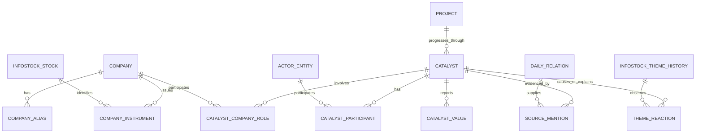

# DAYJAVIEW 회사 중심 사건 온톨로지·자연어 질의 확장 계획

- 문서 상태: 구현 기준 계획안
- 작성일: 2026-08-16
- 갱신일: 2026-08-17 (선행 단계·gold set 최소 표본 기준 추가)
- 대상: E-17 사건 온톨로지 확장, DailyFeaturedTheme 구조화, E-21 회사 중심 자연어 질의
- 관련 문서:
  - [Product Requirements Document](./PRD.md)
  - [화면 명세](./screen_spec.md)
  - [남은 작업](./remaining_work.md)
  - [인포스탁 DB 구현 계획](./infostock_db_implementation_plan.md)
  - [과거 유사사례 매칭 엔진 연구·구현 명세](./historical_event_matching_engine_research_spec.md)
  - [ADR-002 Event ID 수명주기와 장후 revision](./adr/002-event-id-lifecycle.md)
  - [ADR-007 과거 유사사례 검색의 온톨로지 재검증 출시 게이트](./adr/007-historical-matching-release-gate.md)

---

## 1. 목적

현재 E-17 온톨로지는 인포스탁 테마 history 원인문을 다음 네 축으로 분류한다.

- 소재 유형
- 상승·하락 방향
- 확정·기대 여부
- 지속·재부각 여부

이 구조는 “정책 소재에 어떤 테마가 반응했는가” 같은 테마 중심 질문에는 쓸 수 있다. 그러나 “한화에어로스페이스가 직접 체결한 계약만 알려줘” 같은 회사 중심 질문에는 부족하다. 원인문 끝의 주도주 목록에서 회사 이름을 찾을 수는 있지만, 회사가 사건 주체인지 단순 주도주인지 구분하지 못하기 때문이다.

이 계획의 목적은 회사·사건·테마·근거·실제 결과를 명시적으로 연결해 E-21 자연어 리서치가 다음 원칙으로 회사 질문에 답하게 만드는 것이다.

1. 회사 이름이 아니라 안정적인 회사 식별자를 사용한다.
2. 회사가 사건에서 맡은 역할을 구분한다.
3. 동일 사건의 테마·날짜별 반복 기록을 중복 집계하지 않는다.
4. 답변 수치와 목록은 결정론적 질의로 계산한다.
5. 모든 주장에 원문 근거와 데이터 버전을 붙인다.
6. 근거가 부족하면 추측하지 않고 `기록 없음`, `질문 해석 실패`, `제품 범위 밖`으로 답한다.

---

## 2. 현재 기준선

### 2.1 이미 구현된 자산

| 자산 | 현재 상태 | 재사용 원칙 |
|---|---|---|
| 테마 history | 39,696건, 2005~2026년 | 사건 관측 원천으로 유지 |
| E-17 분류 | 28개 소재 유형, 방향·확실성·지속, 근거 span | 기존 결과를 덮어쓰지 않고 새 버전으로 확장 |
| E-17 test | primary 엄격 77.8%, 허용 85.4%, 유형 포함 88.8%, 방향 99.6%, 확실성 90.0% | 알려진 품질 기준선으로 보존 |
| 종목 식별 | `core.infostock_stocks.stock_id`, 6자리 종목코드 | 새 종목 ID를 만들지 않음 |
| 종목명 관측 | `core.infostock_stock_name_observations` | 회사 alias 후보의 원천으로 사용 |
| 과거 주도주 | `core.infostock_theme_history_leaders`가 `stock_id`에 연결 | 역할을 항상 `LEADER`로 보존 |
| 과거 관련주 | `core.infostock_theme_history_memberships`가 `stock_id`에 연결 | `LEADER`와 혼합하지 않음 |
| DailyFeaturedTheme | 게시물 4,655건, 본문 4,655건, 관계 144,961건 | 섹션별 사건 관측 원천으로 사용 |
| Daily 종목 연결 | `core.infostock_daily_relations.stock_id` | 종목 링크가 있는 관계는 재사용 |
| 이벤트 저장소 | `event.events`, 불변 `event_id`, revision 원칙 | 장중 시장 Event 의미를 유지 |
| 자연어 질의 계약 | 닫힌 질의 유형, 슬롯 채우기, 결정론적 계산, 근거 필수 | 자유 SQL·무근거 RAG를 도입하지 않음 |

### 2.2 실제로 부족한 것

기존 DB에 종목 ID와 주도주 관계가 있으므로 “회사 정보가 전혀 없다”는 뜻은 아니다. 부족한 것은 다음 의미 계층이다.

1. `stock_id`는 상장 종목 식별자다. 법인·발행사와 동일한 개념이 아니다.
2. 현재 종목명 관측은 이름의 출처와 관측 시각을 보존하지만 공식 사명 변경 유효기간이나 합병·분할 관계를 확정하지 않는다.
3. 주도주 관계는 저장돼 있지만 사건 주체·계약 당사자·수혜주·피해주·대상 회사 관계는 없다.
4. E-17 라벨 산출물은 테마 history를 분류하지만 `stock_id`·회사 역할·정규화된 사건 ID를 포함하지 않는다.
4-1. 그 라벨은 `research/ontology/labels.jsonl` 파일에만 있고 DB에 없다. migration 0001~0006 어디에도 라벨 테이블이 없으므로, 회사 확장 이전에 소재 유형을 조건으로 거는 질의 자체가 불가능하다.
5. 한 문장에 여러 사건이 있어도 현재는 문장 전체에 유형·확실성을 붙인다.
6. 계약 단계, 상대방, 국가, 프로젝트, 금액·통화가 구조화되지 않았다.
7. 같은 현실 사건이 여러 테마나 여러 날짜에 반복돼도 고유 사건과 후속 진행을 구분하지 않는다.
8. DailyFeaturedTheme는 테마·종목·설명 관계만 파싱됐고 사건 온톨로지는 적용되지 않았다.
9. 테마 방향을 특정 회사의 실제 주가 방향으로 해석할 수 없다.

### 2.3 한화에어로스페이스 실측 예시

현재 로컬 온톨로지 라벨에서 `한화에어로스페이스` 문자열은 테마 기록 156건에 등장한다. 이 중 회사명이 사건 사유 본문에 직접 등장한 것은 13건이며, 나머지는 대부분 문장 끝 주도주 목록에 등장한다.

따라서 단순 문자열 검색은 다음 두 기록을 같은 회사 사건으로 섞는다.

- 회사가 직접 계약을 체결하거나 유상증자를 발표한 기록
- 지정학·정책 같은 테마 전체 사건에서 주도주로 열거된 기록

본 계획은 이 둘을 각각 `ACTOR` 또는 `ISSUER`와 `LEADER`로 분리한다.

---

## 3. 목표와 비목표

### 3.1 목표

- 회사명·과거 사명·종목코드·DART 법인코드를 하나의 회사 정체성으로 해석한다.
- 회사가 사건에서 맡은 역할을 근거 span과 함께 저장한다.
- 사건을 주체·행동·대상·단계·상대방·지역·프로젝트·금액으로 구조화한다.
- 동일 보도의 중복과 프로젝트의 후속 단계를 구분한다.
- 테마 history와 DailyFeaturedTheme에 같은 온톨로지 계약을 적용한다.
- 회사 중심 닫힌 질의 유형을 E-21에 추가한다.
- 답변마다 집계 단위, 표본 수, 기간, 근거 사건, 데이터 버전을 표시한다.
- 회사별 실제 결과 질문은 역사 가격·outcome이 준비된 범위에서만 연다.

### 3.2 비목표

- 자연어를 자유 SQL로 변환하지 않는다.
- 검색된 원문만 보고 LLM이 사실·숫자·순위·확률을 만들지 않는다.
- 주도주로 등장했다는 사실을 사건 수혜주나 회사 자체 사건으로 자동 승격하지 않는다.
- 테마 상승·하락을 개별 종목 수익률로 바꾸지 않는다.
- 이름이 비슷하다는 이유만으로 회사를 자동 병합하지 않는다.
- 미래 주가·매수·매도·목표가 질문에 답하지 않는다.
- 유사사례는 E-19의 2인 블라인드 평가와 새 봉인 구간 검증 전에 열지 않는다.
- 원천 row나 기존 E-17 산출물을 덮어쓰거나 삭제하지 않는다.

### 3.3 기존 E-21 단계와의 관계

이 확장이 기존 E-21 전체를 막지는 않는다.

- E-21 1단계의 현재 시장·테마·종목 질문은 기존 계산 값으로 먼저 출시할 수 있다.
- E-21 2단계의 소재 유형·과거 테마 집계도 현재 E-17 범위에서 별도 출시할 수 있다.
- 본 계획의 회사 직접 사건·역할·금액·Daily 질문은 E-21 2단계의 확장 범위로 순차 개방한다.
- E-21 3단계 유사사례 질문은 회사 온톨로지 완성 여부와 별개로 E-19 gate를 계속 적용한다.

---

## 4. 고객 질문 계약

회사 질문은 닫힌 질의 유형으로만 제공한다. 각 유형은 허용 슬롯, 집계 단위, 필수 근거를 고정한다.

| 질의 ID | 고객 질문 예시 | 기본 집계 단위 | 필요한 구조 | 출시 조건 |
|---|---|---|---|---|
| `COMPANY_APPEARANCE` | “한화에어로스페이스는 언제부터 몇 번 등장했어?” | 원천 관측 | 회사 식별, source mention | 회사 식별 완료 |
| `COMPANY_THEME_ASSOCIATION` | “이 회사는 어떤 테마와 자주 연결됐어?” | 고유 테마 반응 | 회사·테마·역할 | 회사 역할 완료 |
| `COMPANY_DIRECT_EVENT` | “회사가 직접 발표한 사건만 알려줘.” | 고유 catalyst | `ACTOR`·`ISSUER` 역할 | 회사 역할 완료 |
| `COMPANY_CATALYST_DISTRIBUTION` | “주요 사건 유형은 무엇이었어?” | 고유 catalyst | 회사 역할, 소재 유형 | 확장 gold set 통과 |
| `COMPANY_EVENT_STAGE` | “수주 기대와 본계약을 구분해줘.” | 고유 catalyst | 사건 단계, 확실성 | 단계 평가 통과 |
| `COMPANY_COUNTERPARTY` | “폴란드와 관련된 계약은 무엇이야?” | 고유 catalyst | 상대방, 국가, 프로젝트 | 엔티티 평가 통과 |
| `COMPANY_VALUE_SUMMARY` | “확정 수주액 합계는 얼마야?” | 중복 제거된 금액 fact | 금액·통화·단계·중복 제거 | 수치 exact-match gate 통과 |
| `COMPANY_IMPACT_HISTORY` | “하락 원인이 된 회사 사건만 알려줘.” | 회사 영향 관측 | 회사별 영향, 테마 방향 분리 | 영향 평가 통과 |
| `COMPANY_COOCCURRENCE` | “같이 자주 부각된 종목은?” | 고유 catalyst 공동 등장 | 종목 식별, 역할, 중복 제거 | 공동 등장 계약 완료 |
| `COMPANY_DAILY_FEATURED` | “그날 Daily Featured에 왜 나왔어?” | Daily 섹션·catalyst | Daily 섹션 분리와 회사 역할 | Daily gate 통과 |
| `COMPANY_HISTORICAL_OUTCOME` | “수주 뒤 T+5 실제 반응은 어땠어?” | 회사 또는 당시 주도주 outcome | E-16 가격·기업행위·benchmark | E-16 및 outcome gate 통과 |
| `COMPANY_SIMILAR_CASE` | “비슷한 과거 회사 사건은?” | 승인된 검색 결과 | ontology·hybrid 검색 | E-19 통과 |

### 4.1 집계 단위 규칙

“몇 건”이라는 표현은 다음 단위를 화면에 함께 표시한다.

- `원천 기록`: 테마 history row 또는 Daily 섹션 수
- `테마 반응`: 한 날짜·한 테마에서 관측된 반응 수
- `고유 사건`: 중복 보도를 합친 `catalyst_id` 수
- `프로젝트`: 여러 단계의 사건을 묶은 `project_id` 수

기본 회사 사건 집계는 `catalyst_id`를 사용한다. 원천 기록 수를 고유 사건 수처럼 표시하지 않는다.

### 4.2 공통 답변 구조

모든 회사 질문은 기존 FR-11 답변 블록을 유지한다.

1. 해석된 회사·기간·역할·소재·단계·지역 슬롯
2. 한 문장 요약
3. 집계 단위가 표시된 수치 요약
4. 근거 사건 목록
5. 제외·미제시 항목과 이유
6. dataset·company master·ontology·query 버전

---

## 5. 목표 개념 모델

### 5.1 회사와 종목을 분리한다

사용자가 질문하는 “회사”와 거래되는 “종목”은 별도 엔티티다.

- `Company`: 법인·발행사 정체성
- `Instrument`: 종목코드가 붙은 상장 증권
- 기존 `core.infostock_stocks`: 초기 Instrument 정본
- `CompanyInstrument`: 회사와 종목의 유효기간 관계
- `CompanyAlias`: 현재·과거 사명과 출처·유효기간

하나의 회사가 여러 종목을 가질 수 있고, 종목코드·사명은 시간에 따라 달라질 수 있다. 내부 `company_id`는 외부 코드나 이름을 의미로 인코딩하지 않는 안정적인 식별자를 사용한다.

### 5.2 현실 사건과 시장 반응을 분리한다

한 계약이 방산·우주항공·항공기부품 세 테마에 같은 날 기록될 수 있다. 계약은 현실 사건 하나지만 시장 반응은 세 개다.

- `Catalyst`: 현실에서 발생한 원자적 사건
- `ThemeReaction`: 특정 날짜·테마가 그 사건에 반응한 관측
- `SourceMention`: 인포스탁 history, Daily 섹션, 뉴스 등 원천 언급
- `Project`: 기대·입찰·본계약·납품 같은 여러 사건 단계를 묶는 장기 대상

같은 보도의 복제는 하나의 `catalyst_id`로 합친다. 기대에서 본계약으로 진행된 것은 같은 사건으로 덮어쓰지 않고 별도 catalyst를 만들고 같은 `project_id`와 `ADVANCES` 관계로 연결한다.

### 5.3 관계 구조



### 5.4 일반 참여자

계약 상대방이 해외 정부·기관·개인일 수 있으므로 모든 참여자를 회사 테이블에 넣지 않는다. `ActorEntity`는 `COMPANY`, `GOVERNMENT`, `PUBLIC_INSTITUTION`, `PERSON`, `INTERNATIONAL_ORGANIZATION`, `COUNTRY`, `OTHER` 유형을 가진다. 회사형 참여자는 `company_id`를 함께 가리키고, 비회사 참여자는 별도 정규화 이름·alias·근거를 가진다.

`CatalystParticipant`는 주체·상대방·발표자·규제기관·대상을 표현한다. “폴란드와 체결한 계약”은 geography 문자열 검색만 하지 않고 폴란드 정부·기관 참여자 또는 정규화된 국가 관계로 찾는다.

### 5.5 회사 역할

역할은 한 회사에 여러 개 붙을 수 있으며 각 역할에 근거 span이 필요하다.

| 역할 | 의미 | 자동 생성 기준 |
|---|---|---|
| `ACTOR` | 발표·투자·개발·행동 주체 | 문장 주어와 행동 근거가 명시됨 |
| `ISSUER` | 실적·증자·상장 등 자본시장 사건의 발행사 | 회사명과 발행 행위가 명시됨 |
| `CONTRACTOR` | 계약을 수주·체결한 공급자 | 계약 행위와 회사명이 명시됨 |
| `COUNTERPARTY` | 계약·협력 상대방 | 상대 역할이 명시됨 |
| `TARGET` | 인수·제재·소송·규제 대상 | 대상 관계가 명시됨 |
| `BENEFICIARY` | 원문이 수혜를 명시한 회사 | “수혜” 근거가 직접 존재함 |
| `ADVERSELY_AFFECTED` | 원문이 피해·부담을 명시한 회사 | 부정 영향 근거가 직접 존재함 |
| `LEADER` | 원천의 당시 주도주 목록 | 기존 history leader row에서 결정론적으로 생성 |
| `RELATED` | 관련주·구성종목으로만 확인됨 | 기존 membership 또는 Daily 관계 |

`LEADER`나 `RELATED`를 근거 없이 `BENEFICIARY`로 바꾸지 않는다.

`COMPANY_DIRECT_EVENT`의 기본 역할은 `ACTOR`, `ISSUER`, `CONTRACTOR`, `TARGET`이다. `BENEFICIARY`, `ADVERSELY_AFFECTED`, `LEADER`, `RELATED`는 사용자가 해당 역할을 요청했을 때만 포함한다.

### 5.6 사건 필드

최소 사건 revision은 다음 필드를 가진다.

```text
catalyst_id
revision_no
occurred_on
known_at
primary_catalyst_type
catalyst_types
event_stage
certainty
novelty_type
action
object
project_id
geography_ids
officiality
continuation
ontology_version
transform_version
dataset_hash
content_hash
```

방향은 현실 사건 자체가 아니라 `ThemeReaction`과 `CatalystCompanyRole.impact`에 각각 둔다.

- 테마 반응: `UP`, `DOWN`, `MIXED`, `UNKNOWN`
- 회사 영향: `POSITIVE`, `NEGATIVE`, `MIXED`, `UNKNOWN`
- 실제 종목 결과: 별도 `Outcome`

### 5.7 단계와 프로젝트

단계는 사건 유형별 통제어휘와 인접 관계를 가진다. 수주·계약의 초기 단계는 다음과 같다.

```text
RUMOR
REVIEW
DISCUSSION
BID
SHORTLIST
PREFERRED_BIDDER
SIGNED
EXECUTING
COMPLETED
DELAYED
CANCELLED
UNSPECIFIED
```

단계가 다르면 별도 catalyst다. 같은 프로젝트의 진행인지 확인된 경우에만 `project_id`를 공유한다.

### 5.8 금액·수량 fact

금액 합계 질문은 원문 문자열을 직접 더하지 않는다. 다음 단위로 정규화한다.

```text
fact_type
reported_value
normalized_value
unit
currency
value_basis
effective_on
evidence_span
```

초기 `fact_type`은 `CONTRACT_VALUE`, `INVESTMENT_VALUE`, `CAPACITY`, `QUANTITY`, `STAKE_PERCENT`로 제한한다. 범위값·최대값·총사업비·회사 몫을 구분하지 못하면 합계에서 제외하고 미제시 사유를 표시한다.

---

## 6. 저장 모델 계획

정확한 DDL은 1단계 구현에서 확정하되 책임은 다음처럼 나눈다.

### 6.1 `core` 기준정보

- `core.company_entities`
- `core.company_aliases`
- `core.company_instruments`

기존 `core.infostock_stocks`와 `core.infostock_stock_name_observations`를 Instrument 원천으로 재사용한다. `company_entities`에 종목명 관측을 복사해 별도 정본을 만들지 않는다.

### 6.2 `ontology` 사건 구조

- `ontology.catalysts`
- `ontology.catalyst_revisions`
- `ontology.actor_entities`
- `ontology.actor_aliases`
- `ontology.catalyst_participants`
- `ontology.projects`
- `ontology.project_aliases`
- `ontology.geographies`
- `ontology.source_mentions`
- `ontology.source_mention_*` source별 typed link
- `ontology.catalyst_company_roles`
- `ontology.theme_reactions`
- `ontology.catalyst_values`
- `ontology.catalyst_relations`
- `ontology.artifacts`

모든 분류 결과는 revision append 방식으로 쓴다. 현재 projection을 편의상 만들 수 있지만 이전 revision을 삭제하지 않는다.

`geographies`는 ISO 국가 코드와 통제된 권역 계층을 사용한다. 회사 국적만 보고 사건 지역을 추정하지 않는다.

### 6.3 원천 연결

`source_mentions`에 검증할 수 없는 `source_kind + source_id` 다형 참조를 두지 않는다. 공통 mention metadata와 source별 typed link table을 분리해 실제 FK를 유지한다.

- `INFOSTOCK_THEME_HISTORY`
- `INFOSTOCK_DAILY_DESCRIPTION`
- `INFOSTOCK_DAILY_THEME_STOCK`
- `NEWS_CATALYST_EVIDENCE`
- `MANUAL_REVIEW`

예를 들어 history·Daily·news는 각각 `source_mention_history`, `source_mention_daily`, `source_mention_news` bridge에서 원천 PK를 참조한다. mention 하나에는 source link가 정확히 하나만 존재해야 한다.

각 mention은 source revision·원문 hash·문자 오프셋·수집 시각을 가진다. 원문을 ontology 테이블에 중복 저장하지 않는다.

### 6.4 기존 `event.events`와의 관계

`event.events`는 한 거래일의 한 테마·촉매 시장 움직임을 식별한다. `ontology.catalysts`는 여러 테마가 공유할 수 있는 현실 사건을 식별한다. 둘을 합치지 않는다.

장중 Event나 과거 테마 반응이 현실 사건에 정합되면 `catalyst_id`를 classification revision에 연결한다. 장후 분류 변경은 ADR-002대로 기존 `event_id`를 유지한다.

---

## 7. 변환 파이프라인

### 7.1 회사 master 구축

식별 우선순위는 다음과 같다.

1. 원천 종목 링크의 6자리 종목코드
2. 기존 `stock_id` 연결
3. DART `corp_code`와 종목코드 매핑
4. 해당 시점에 유효한 exact alias
5. 미해결

공백·법인 표기·시장 접미사 같은 안전한 정규화만 자동 적용한다. 편집거리나 임베딩으로 회사를 자동 연결하지 않는다. fuzzy 후보는 운영자 검수 제안으로만 사용한다.

### 7.2 테마 history 처리

1. 기존 `parse_cause_sentence`로 주도주 괄호와 방향 꼬리를 분리한다.
2. 사유 본문을 복합 사건 절로 나눈다.
3. 기존 history leader는 `LEADER` 역할로 연결한다.
4. 각 절에서 회사·기관·국가·행동·대상·단계·금액 span을 추출한다.
5. 소재 유형·확실성·지속을 절 단위로 다시 계산한다.
6. 한 history row가 여러 catalyst를 가리키면 각각 별도 mention을 만든다.
7. 원 history row의 방향은 각각의 `ThemeReaction`에 보존한다.

### 7.3 DailyFeaturedTheme 처리

1. 현재 `DESCRIPTION`과 `THEME_STOCK` 관계를 재사용한다.
2. `DESCRIPTION`을 테마 섹션의 사건 텍스트로 취급한다.
3. `THEME_STOCK`은 `RELATED` 관계로 시작하며 원문이 역할을 명시할 때만 승격한다.
4. 자유 서술형 `테마시황`은 문장·절 분리 뒤 개별 catalyst mention으로 만든다.
5. 현재 `PARSE_PARTIAL` 1,294건을 형식군별로 분류하고, 지원하지 않는 형식은 원문 보존 후 서빙 대상에서 제외한다.
6. 긴 글 전체를 하나의 사건으로 분류하지 않는다.

### 7.4 규칙과 LLM의 책임

다음은 규칙 기반으로 처리한다.

- 종목코드와 source link 해석
- exact alias 연결
- 기존 주도주·관련주 역할
- 날짜·금액·통화의 명시 패턴
- 방향 꼬리와 확실성 표지
- 기존 통제어휘 키워드

LLM은 규칙으로 해석하지 못한 비정형 절의 구조 추출에만 선택적으로 사용한다.

- 출력은 허용된 ID·enum만 사용한다.
- 모든 값에 evidence span이 필요하다.
- 원문에 없는 회사·금액·단계는 생성할 수 없다.
- 계산·집계·중복 제거 점수·수익률은 생성하지 않는다.
- validation 실패 출력은 버리고 `UNRESOLVED`로 남긴다.
- model·prompt·schema·input hash를 보존한다.

### 7.5 사건 중복 제거와 수명주기

중복 후보 키는 다음 요소를 사용한다.

- 사건 날짜 또는 명시된 유효일
- 주체·상대방 회사 ID
- 행동·대상
- 프로젝트 ID
- 단계
- 정규화된 금액·수량
- 원문 fingerprint

원칙은 precision 우선이다.

- 같은 원문 복제나 같은 날 여러 테마의 동일 서술은 자동 병합 가능하다.
- 날짜가 다르거나 단계가 다르면 기본적으로 별도 catalyst다.
- 비슷한 수익률이나 같은 테마라는 이유로 병합하지 않는다.
- 애매한 후보는 `POSSIBLE_DUPLICATE`로 남기고 자동 집계에서 분리한다.
- 운영자 병합·분리 결과는 새 revision과 사유를 남긴다.

### 7.6 artifact 발행

서빙 가능한 artifact는 다음 버전과 hash를 고정한다.

- source dataset hash
- company master version
- alias version
- ontology vocabulary version
- transform version
- dedup policy version
- query contract version
- 생성 시각과 코드 commit

`latest` 같은 mutable 경로를 일반 사용자 API가 직접 읽지 않는다.

---

## 8. 자연어 질의 실행 구조

```text
질문 분류
회사·기간·역할·소재·단계 슬롯 해석
닫힌 QueryPlan 생성
결정론적 repository 질의
집계와 근거 목록 생성
문장 renderer
FR-11 답변 블록 반환
```

### 8.1 회사 슬롯 해석

회사는 다음 순서로 해석한다.

1. 종목코드 exact match
2. 현재 회사명 exact match
3. 질문 기간과 겹치는 과거 alias exact match
4. 복수 후보 반환
5. 후보가 없으면 질문 해석 실패

복수 후보를 LLM이 임의로 고르지 않는다. 사용자가 선택한 `company_id`를 해석 블록에 표시한다.

### 8.2 QueryPlan 예시

질문: “2024년 한화에어로스페이스가 직접 체결한 해외 계약만 보여줘.”

```json
{
  "queryType": "COMPANY_DIRECT_EVENT",
  "companyId": "<resolved-company-id>",
  "period": {"from": "2024-01-01", "to": "2024-12-31"},
  "roles": ["CONTRACTOR"],
  "catalystTypes": ["ORDER_CONTRACT"],
  "eventStages": ["SIGNED"],
  "geography": "NON_KR",
  "countUnit": "CATALYST"
}
```

LLM은 이 plan에 없는 필터를 추가하거나 SQL을 작성하지 않는다.

### 8.3 답변 실패

기존 세 가지 public 실패 사유를 유지하고 내부 세부 사유를 매핑한다.

| 내부 사유 | public 사유 | 처리 |
|---|---|---|
| `UNKNOWN_COMPANY` | 질문 해석 실패 | 회사 후보 또는 종목코드 입력 제안 |
| `AMBIGUOUS_ALIAS` | 질문 해석 실패 | 유효기간·종목코드 포함 후보 제시 |
| `NO_MATCHING_EVENT` | 기록 없음 | 기간·역할 범위 확대 제안 |
| `UNSUPPORTED_QUERY_TYPE` | 제품 범위 밖 | 지원 질문 예시 제시 |
| `OUTCOME_GATE_CLOSED` | 제품 범위 밖 | 과거 사건 목록만 대안으로 제시 |
| `SIMILARITY_GATE_CLOSED` | 제품 범위 밖 | 소재·단계 집계 질문 제시 |
| `INSUFFICIENT_EVIDENCE` | 기록 없음 | 불확실 기록을 수치에 포함하지 않았다고 명시 |

### 8.4 캐시와 재현성

질문 문자열이 아니라 해석된 QueryPlan을 cache key로 사용한다. key에는 company master·ontology·dataset·query contract version을 포함한다. 같은 plan과 같은 artifact는 같은 정렬·수치·근거 목록을 반환해야 한다.

---

## 9. 구현 단계

### 선행 단계. 기존 E-17 라벨 DB 적재

이 계획의 모든 단계는 기존 E-17 결과를 DB에서 join할 수 있다고 전제한다. 현재는 그렇지 않다. `label_theme_history.py` 산출물은 `research/ontology/labels.jsonl`에만 있고, 라벨을 담는 테이블이 migration에 없다. 따라서 회사 확장 이전에 테마 중심 질의조차 실행할 수 없다.

할 일:

- `ontology` 스키마와 테마 history 라벨 테이블을 추가한다. 행 단위는 `(history_id, vocabulary_version, transform_version)`이다.
- 유형 목록, primary 유형, 방향, 확실성, 지속 여부, evidence span을 저장한다. span은 `raw_text` 문자 오프셋 의미를 그대로 유지한다.
- 통제어휘 자체(`type_id`, `name_ko`, `description_ko`, `vocabulary_content_hash`)를 참조 테이블로 함께 적재한다.
- 적재는 덮어쓰기가 아니라 버전 append다. 같은 `history_id`에 이전 어휘 버전 라벨이 남아 있어야 한다.
- 적재 job은 재실행해도 같은 결과가 되어야 한다(idempotent).
- `dayjaview_api_reader`에 SELECT 권한만 부여한다.

완료 조건:

- "이 소재 유형에 과거 어떤 테마가 반응했는가"를 SQL 한 번으로 계산할 수 있다.
- 라벨 행마다 어휘 버전·변환 버전·content hash가 붙어 어떤 어휘로 분류했는지 재현된다.
- 파일 산출물과 DB 적재 결과의 행 수·분포가 일치한다.

### 단계 0. 질문 계약과 gold set 고정

할 일:

- 4절의 회사 질의 유형·슬롯·집계 단위를 기계 enum으로 고정한다.
- 직접 사건, 주도주 전용, 과거 사명, 복합 사건, 금액, Daily 형식을 층화 표집한다.
- 표본군마다 최소 건수를 채운다. 무작위 표집만으로는 희소 구간이 측정 불가 상태로 남는다 — 기존 E-17 gold set 1,000건(dev 500·test 500)에서 인수합병 primary는 전체 245건(0.6%)이라 test split 기대 편입량이 약 3건이고, 구조조정·신용 171건과 콘텐츠 성과 170건도 약 2건씩이다. 이 수량으로는 해당 구간 정확도를 보고할 수 없다.
- 개발용과 최종 측정용 gold set을 분리한다.
- 회사 역할·사건 단계·중복 쌍은 2인 독립 라벨과 불일치 조정을 사용한다.
- 한화에어로스페이스처럼 “이름 등장”과 “회사 자체 사건”이 크게 다른 회귀 fixture를 포함한다.

완료 조건:

- 질문 유형별 기대 QueryPlan과 기대 답변 수치가 고정된다.
- test split은 transform 개선에 사용하지 않는다.

### 단계 1. 회사 정체성과 alias

할 일:

- 기존 `stock_id`를 Instrument로 재사용한다.
- 회사·alias·회사-종목 유효기간 모델을 추가한다.
- KRX 종목코드와 DART `corp_code`를 외부 식별자로 연결한다.
- 과거 사명·상장폐지·합병·분할을 revision으로 저장한다.
- 미해결 과거 주도주 90건은 임의 연결하지 않고 검수 대상으로 남긴다.

완료 조건:

- 현재 이름·과거 이름·종목코드가 같은 `company_id`로 재현된다.
- 특정 시점에 유효하지 않은 alias로 자동 연결되지 않는다.

### 단계 2. history 회사 역할 연결

할 일:

- 기존 history leader와 membership을 회사에 연결한다.
- 사유 본문 회사 mention과 주도주 목록 mention을 분리한다.
- `ACTOR`, `ISSUER`, `CONTRACTOR`, `COUNTERPARTY`, `TARGET`, `BENEFICIARY`, `ADVERSELY_AFFECTED`, `LEADER`, `RELATED`를 추출한다.
- 역할별 evidence span과 resolution status를 저장한다.

완료 조건:

- `COMPANY_APPEARANCE`, `COMPANY_THEME_ASSOCIATION`, `COMPANY_DIRECT_EVENT` 질의를 결정론적으로 계산할 수 있다.
- `LEADER`만 있는 기록이 회사 자체 사건 집계에 들어가지 않는다.

### 단계 3. 사건 구조·단계·중복 제거

할 일:

- 복합 문장 절 분리와 catalyst revision을 구현한다.
- 단계·프로젝트·상대방·지역·금액을 추출한다.
- 같은 보도 중복과 프로젝트 후속 단계를 구분한다.
- 원천 기록·테마 반응·고유 사건·프로젝트 집계 단위를 모두 제공한다.

완료 조건:

- 수주 기대와 본계약이 별도 catalyst로 보존되고 같은 프로젝트로 연결된다.
- 동일 계약의 여러 테마 기록이 고유 사건 집계에서 한 번만 계산된다.

### 단계 4. DailyFeaturedTheme 온톨로지화

할 일:

- Daily section·description·theme-stock 관계를 catalyst mention으로 변환한다.
- `PARSE_PARTIAL` 1,294건을 형식군별로 감사하고 지원 형식을 늘린다.
- 긴 테마시황을 문장·절 단위로 분리한다.
- Daily 전용 coverage·role·span 보고서를 만든다.

완료 조건:

- `COMPANY_DAILY_FEATURED` 질문이 날짜·테마·회사 역할·근거를 반환한다.
- 부분 파싱 원문을 성공으로 오표시하지 않는다.

### 단계 5. E-21 회사 질의

할 일:

- 회사 질의 classifier와 slot resolver를 구현한다.
- QueryPlan별 repository 함수를 만든다.
- 답변 수치·근거·미제시 사유를 API 계약에 추가한다.
- `/research` 예시 질문을 현재 열린 유형만 반영하도록 갱신한다.
- 직전 회사·기간 슬롯을 이어받을 때 해석 블록에 표시한다.

완료 조건:

- 같은 QueryPlan이 같은 답을 반환한다.
- 질문 해석 실패와 기록 없음이 구분된다.
- 회사 역할·집계 단위·표본 수가 화면에 표시된다.

### 단계 6. 수치·실제 결과 질문

할 일:

- 금액·통화·범위·회사 귀속분을 정규화한다.
- E-16 일봉과 기업행위 보정 결과를 회사·종목·사건 시점에 연결한다.
- 테마 방향과 개별 종목 실제 수익률을 별도 필드로 표시한다.
- 표본 수·eligible count·observed count·누락 사유를 보존한다.

완료 조건:

- 금액 합계와 수익률 집계가 중복 사건을 포함하지 않는다.
- 가격 누락을 0으로 바꾸지 않는다.
- 결과 질문은 E-16 gate를 통과한 범위에서만 열린다.

### 단계 7. 유사사례와 운영 승격

할 일:

- 회사·역할·단계·프로젝트 특징을 E-19 검색 후보에 추가한다.
- M-TXT·ontology·hybrid를 동일 fold에서 비교한다.
- 승인 artifact만 production registry에 승격한다.
- 낮은 confidence·미해결 alias·중복 후보를 운영자 검수로 보낸다.

완료 조건:

- E-19의 2인 블라인드와 새 봉인 구간 gate를 통과한다.
- 미승인 artifact나 mutable `latest`를 API가 읽지 않는다.

### 단계 요약과 결정 주체

| 순서 | 단계 | 무엇이 열리는가 | 결정·수행 주체 |
|---|---|---|---|
| 1 | 선행 | 테마 중심 질의가 SQL로 가능해진다 | 구현 |
| 2 | 0 | 답할 질문 목록과 채점 기준이 확정된다 | **제품 결정** + 라벨 검수 인력 |
| 3 | 1 | 사명이 바뀌어도 같은 회사로 해석된다 | 구현 |
| 4 | 2 | 회사 자체 사건과 주도주 전용 기록이 분리된다 | 구현 |
| 5 | 3 | 중복 집계가 사라지고 계약 단계가 구분된다 | 구현 |
| 6 | 4 | Daily 게시물이 사건 단위로 조회된다 | 구현 |
| 7 | 5 | 회사 질문에 근거 있는 답이 나간다 | 구현 |
| 8 | 6 | 금액 합계와 실제 수익률 질문이 열린다 | 구현 (E-16 gate 종속) |
| 9 | 7 | 유사사례 검색에 회사·역할이 반영된다 | 구현 (E-19 gate 종속) |

선행 단계와 단계 0은 서로 의존하지 않으므로 병행할 수 있다. 단계 1 이후는 앞 단계 완료 조건을 전제한다.

단계 0에는 사람이 정답을 붙이는 작업이 포함되므로 착수 전에 검수 담당과 분량을 확정한다. LLM 초안 후 사람 검수 방식을 쓰더라도 최종 라벨 책임은 사람에게 남긴다.

---

## 10. 코드·산출물 위치

구현 시 다음 위치를 기준으로 한다.

```text
packages/ontology/
  company_entities.py
  participants.py
  projects.py
  event_structure.py
  company_roles.py
  event_dedup.py
  query_contracts.py

apps/worker-batch/ontology/
  build_company_master.py
  label_company_events.py
  label_daily_events.py
  publish_company_ontology.py

tests/ontology/
  company_goldset_dev.tsv
  company_goldset_test.tsv
  test_company_entities.py
  test_company_roles.py
  test_event_structure.py
  test_event_dedup.py
  test_company_queries.py

research/ontology/
  company_labels.jsonl
  company_score_*.json
  daily_coverage_report.json
  company_ontology_artifact.json

infra/migrations/
  0007_theme_catalyst_labels.sql
  0008_company_event_ontology.sql
```

`0007_theme_catalyst_labels.sql`은 선행 단계의 기존 E-17 라벨 적재용이며, 회사 확장 migration보다 앞선다. 적재 job은 `apps/worker-batch/ontology/load_theme_catalyst_labels.py`로 두고 `label_theme_history.py`의 파일 산출 책임과 분리한다.

현재 `packages/ontology`를 확장한다. 같은 분류 책임을 별도 최상위 패키지로 복제하지 않는다.

tracked gold set에는 source key와 라벨만 둔다. 저작권 원문과 key join 결과는 gitignore된 `research/ontology/`에만 둔다.

---

## 11. 검증 계획과 출시 gate

### 11.1 gold set 구성

다음 표본군을 분리해 포함한다.

- 회사가 사건 주체인 문장
- 회사가 주도주 목록에만 있는 문장
- 회사가 수혜·피해 대상으로 명시된 문장
- 과거 사명·동명이인·이름 변형
- 한 문장에 여러 회사·여러 사건이 있는 문장
- 기대·입찰·본계약·취소 단계
- 금액·통화·범위 표현
- 같은 사건의 여러 테마·날짜 중복
- Daily 정형 표와 자유 서술

각 표본군은 test split 기준 **최소 30건**을 채운다. 30건 미만인 구간은 정확도를 보고하지 않고 `측정 불가`로 표시하며, 해당 구간에 의존하는 질문 유형은 열지 않는다.

설계·개선용 dev와 최종 측정용 test를 분리한다. test 불일치를 보고 어휘나 규칙을 수정한 뒤 같은 test 점수를 최종값으로 다시 사용하지 않는다.

기존 E-17에서 이 분리 효과가 실측됐다. 어휘 v1.2.0 기준 primary 엄격 정확도는 dev split 87.8%, test split 77.8%로 10.0%p 차이가 난다. dev를 보며 어휘를 고친 결과이므로 **77.8%가 실제 성능**이다. 회사 온톨로지에서도 dev 점수를 승격 근거로 쓰지 않는다.

### 11.2 최소 자동 승격 기준

| 항목 | 기준 | 실패 처리 |
|---|---|---|
| 코드 기반 회사 연결 precision | 100% | import 실패 |
| alias 자동 연결 precision | 99.5% 이상 | 애매한 alias 자동 연결 중지 |
| 회사 역할 precision | 95% 이상 | 미달 역할 서빙 제외 |
| 핵심 역할 macro F1 | 90% 이상 | 규칙·gold set 재검토 |
| 사건 단계 정확도 | 90% 이상 | 단계 질문 잠금 |
| 금액·통화 exact match | 98% 이상 | 합계 질문 잠금 |
| 중복 병합 pair precision | 98% 이상 | 자동 병합 범위 축소 |
| 중복 병합 pair recall | 90% 이상 | 누락 경고와 운영 검수 |
| evidence span 유효성 | 100% | 해당 fact 폐기 |
| 사용자 답변 근거 coverage | 100% | 답변 거부 |
| QueryPlan 계산 fixture | 100% | 배포 차단 |
| 동일 artifact 재현성 | hash 일치 | 배포 차단 |

precision을 recall보다 우선한다. 연결하지 못한 기록은 허용하지만 잘못된 회사에 연결한 기록은 자동 서빙하지 않는다.

### 11.3 테스트 계층

- unit: 이름 정규화, alias 유효기간, 절 분리, 역할, 단계, 금액, span
- invariant: 한 role fact에 회사와 근거가 반드시 존재
- property: 입력 순서가 바뀌어도 canonical 결과가 같음
- integration: PostgreSQL import·revision·idempotency·FK
- regression: 한화에어로스페이스 직접 사건과 주도주 전용 기록 분리
- query contract: 질문, 해석 슬롯, 집계, 정렬, 근거 사건 exact match
- leakage: 사건 분류·중복 판단에 미래 가격을 사용하지 않음
- rights: 허용된 원문만 근거로 제공하고 원문 전체 재배포 금지
- performance: 전체 corpus 기준 회사 질의 P95 2초 이내

### 11.4 사용자 검증 예시

아래 질문이 서로 다른 답을 내야 한다.

1. “한화에어로스페이스가 언급된 기록은 몇 건인가?”
2. “한화에어로스페이스가 직접 행동한 고유 사건은 몇 건인가?”
3. “한화에어로스페이스가 주도주로만 등장한 테마 반응은 몇 건인가?”
4. “확정된 해외 수주만 몇 건인가?”

각 답변은 원천 기록·테마 반응·고유 사건 중 어떤 단위를 센 것인지 명시해야 한다.

---

## 12. 위험과 대응

| 위험 | 영향 | 대응 |
|---|---|---|
| 과거 사명 오연결 | 다른 회사 사건 혼입 | 시점 유효 alias와 종목코드 우선, fuzzy 자동 연결 금지 |
| 주도주를 사건 주체로 오해 | 회사 자체 사건 수 과대계상 | `LEADER`를 독립 역할로 고정 |
| 복합 문장 전체 분류 | 회사·단계·확실성 혼합 | 절 단위 catalyst 생성 |
| 같은 계약 중복 집계 | 빈도·금액 과대계상 | `catalyst_id`와 project lifecycle 분리 |
| 후속 단계를 중복으로 병합 | 기대와 체결 이력 소실 | 단계 변경은 별도 catalyst와 `ADVANCES` 관계 |
| Daily 긴 본문 오분류 | 관련 없는 회사·사건 연결 | 섹션·문장·절 분리, 미지원 형식 제외 |
| 테마 방향을 회사 수익률로 오해 | 잘못된 투자 해석 | ThemeReaction·CompanyImpact·Outcome 분리 |
| LLM 근거 없는 구조 생성 | 허위 회사·금액 | enum·span validation, 실패 출력 폐기 |
| test set 반복 사용 | 품질 과대평가 | dev/test 분리와 새 봉인 표본 |
| 질문 로그 축적 | 제품 privacy 위반 | 질의 원문 저장 금지, 실패 사유 집계만 허용 |

---

## 13. 최종 완료 조건

- [ ] 기존 E-17 라벨이 버전과 함께 DB에 적재돼 SQL로 join된다.
- [ ] gold set 각 표본군이 test split 기준 30건 이상이거나 `측정 불가`로 표시된다.
- [ ] 회사·종목·alias·유효기간이 분리돼 있다.
- [ ] 기존 `stock_id`와 history leader·Daily relation을 재사용한다.
- [ ] 회사 역할과 근거 span이 revision으로 저장된다.
- [ ] 회사 자체 사건과 주도주 전용 기록이 분리된다.
- [ ] 현실 사건과 테마 반응이 서로 다른 식별자를 가진다.
- [ ] 같은 보도 중복과 프로젝트 후속 단계가 구분된다.
- [ ] DailyFeaturedTheme가 섹션·사건 단위로 온톨로지화된다.
- [ ] 닫힌 회사 질의 유형과 QueryPlan이 기계 계약으로 고정된다.
- [ ] 답변 수치는 결정론적으로 계산되고 표본 수·집계 단위가 표시된다.
- [ ] 모든 사용자 답변에 근거 사건과 artifact version이 있다.
- [ ] 질문 해석 실패·기록 없음·제품 범위 밖이 구분된다.
- [ ] 미래 예측·매매 판단은 계속 차단된다.
- [ ] 회사 결과 질문은 E-16, 유사사례 질문은 E-19 gate를 각각 지킨다.
- [ ] 11절 품질 gate와 전체 관련 테스트가 통과한다.

이 조건을 모두 충족해야 “회사 이름을 검색할 수 있다”가 아니라 “회사의 역할과 사건을 이해해 근거 있는 자연어 답변을 제공한다”고 판단한다.
