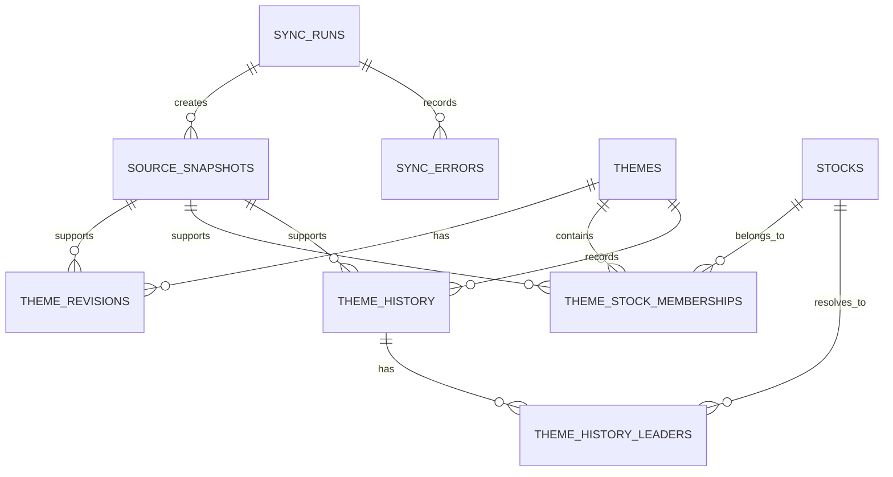

# DAYJAVIEW 인포스탁 DB 구현 계획서

- 문서 상태: 구현 기준안
- 작성일: 2026-08-13
- 대상: DAYJAVIEW의 인포스탁 국내 테마 원천 DB
- 관련 문서:
  - [DAYJAVIEW Product Requirements Document](./PRD.md)
  - [과거 유사사례 매칭 엔진 연구·구현 명세](./historical_event_matching_engine_research_spec.md)
  - [제품 의사결정 기록](./product_decisions.md)

---

## 1. 목적

인포스탁의 국내 테마 데이터를 DAYJAVIEW가 반복 수집·검증·갱신할 수 있는 형태로 저장한다.

DB는 다음 질문에 답할 수 있어야 한다.

1. 현재 존재하는 국내 테마는 무엇인가?
2. 각 테마의 설명은 무엇인가?
3. 각 테마에는 어떤 히스토리가 있는가?
4. 각 히스토리 발생 당시 인포스탁이 기록한 주도주는 누구인가?
5. 현재 각 테마에 포함된 관련주는 누구이며 편입 이유는 무엇인가?
6. 원천 내용이 언제 수집되고 변경됐는가?

핵심 원칙:

> 현재 관련주 목록과 과거 이벤트 당시 주도주 목록을 절대 같은 데이터로 취급하지 않는다.

---

## 2. 구현 범위

### 2.1 포함

- 전체 국내 테마 목록
- 인포스탁 테마 ID, 테마명, 상세 URL
- 테마 설명
- 테마별 히스토리 날짜와 원문
- 히스토리별 당시 주도주 이름, 종목코드, 표시 순서
- 현재 테마 관련주 이름, 종목코드, 편입 이유, 인포스탁 표시 순서
- 테마·설명·관련주·편입 이유 변경 이력
- 원천 페이지 수집 기록과 파서 버전
- 동기화 실행 결과와 오류

### 2.2 제외

- 미국 관련 테마
- 화면에 표시되는 실시간 등락률의 기준값 저장
- 실시간 시세, 일봉, 뉴스, 공시
- 유사사례 점수, T+1·T+5·T+20 결과
- 장중 자체 탐지 테마

화면 등락률은 수집 시각마다 변하는 시장 데이터다. 관련주 관계의 속성으로 저장하지 않고 별도 시세 파이프라인에서 관리한다. 필요하면 원본 스냅샷에만 남긴다.

---

## 3. 확인된 인포스탁 페이지 구조

### 3.1 전체 목록

- URL: `https://infostock.co.kr/Theme/ThemeDB/ThemeAll`
- 수집값:
  - 인포스탁 테마 ID
  - 테마명
  - 상세 URL

### 3.2 상세 페이지

- URL 형태: `https://infostock.co.kr/Theme/ThemeDB/{theme_id}`
- 수집값:
  - 테마명
  - 테마 설명
  - 히스토리 날짜
  - 히스토리 원문
  - 당시 주도주
  - 관련주 종목명·종목코드
  - 관련주 편입 이유

히스토리는 최초 일부만 보이며 `더보기`로 과거 항목이 추가된다. 수집기는 행 수가 더 이상 증가하지 않을 때까지 확장해야 한다.

주도주는 가능한 경우 종목 상세 URL에서 6자리 코드를 얻는다. 상장폐지·종목명 변경 등으로 링크가 없는 주도주도 존재하므로 이름 원문을 항상 보존하고 `stock_id`는 nullable로 둔다.

`주요종목순`은 현재 관련주 표시 순서다. 과거 이벤트의 `주도주`와 같은 의미로 사용하지 않는다.

---

## 4. 권장 기술 기준

### 4.1 DBMS

- PostgreSQL 16 이상
- 문자 인코딩: UTF-8
- 내부 시각: `timestamptz`로 UTC 저장
- 이벤트 날짜: 한국 거래일 기준 `date`
- 마이그레이션 기반 스키마 변경

PostgreSQL 선택 이유:

- 관계 무결성과 시점 이력 관리에 적합
- 부분 unique index와 JSONB 지원
- 향후 전문 검색, `pg_trgm`, `pgvector` 확장 가능
- DAYJAVIEW의 이벤트·가격·특징 테이블과 한 DB에서 연결 가능

### 4.2 데이터 계층

```text
인포스탁 로그인 세션
  -> 원본 스냅샷
  -> 파싱·검증 staging
  -> 정규화 core 테이블
  -> DAYJAVIEW events/event_stocks 연결
```

- `ingest`: 수집 실행, 원본 스냅샷, 오류
- `core`: 테마, 종목, 관련주, 히스토리, 당시 주도주
- 분석 결과 테이블은 이번 구현 범위 밖

원본 HTML 또는 JSON 본문은 압축 파일·객체 저장소에 두고 DB에는 해시와 위치를 저장한다. 초기 로컬 개발에서는 `data/raw/infostock/` 사용 가능하지만 원본은 Git에 커밋하지 않는다.

---

## 5. 데이터 모델



### 5.1 `themes`

테마의 변하지 않는 내부 식별자와 현재 상태를 저장한다.

| 컬럼 | 타입 | 규칙 |
|---|---|---|
| `theme_id` | bigint | PK, identity |
| `source_provider` | text | 기본값 `INFOSTOCK` |
| `source_theme_id` | text | 인포스탁 URL의 테마 ID |
| `current_name` | text | 현재 테마명 |
| `source_url` | text | 상세 URL |
| `is_active` | boolean | 현재 전체 목록 존재 여부 |
| `first_seen_at` | timestamptz | 최초 확인 시각 |
| `last_seen_at` | timestamptz | 마지막 확인 시각 |
| `created_at` | timestamptz | 생성 시각 |
| `updated_at` | timestamptz | 변경 시각 |

제약:

- unique: `(source_provider, source_theme_id)`
- 삭제 대신 `is_active=false`
- 전체 목록 한 번 누락만으로 비활성화하지 않음

### 5.2 `theme_revisions`

테마명·설명 수정 이력을 보존한다.

| 컬럼 | 타입 | 규칙 |
|---|---|---|
| `theme_revision_id` | bigint | PK |
| `theme_id` | bigint | FK -> `themes` |
| `theme_name` | text | 해당 버전 테마명 |
| `description` | text | 설명 원문 |
| `content_hash` | char(64) | 정규화 본문 SHA-256 |
| `observed_from` | timestamptz | 이 버전을 처음 확인한 시각 |
| `observed_to` | timestamptz | 다음 버전을 처음 확인한 시각, 현재는 null |
| `snapshot_id` | bigint | 근거 원본 |

제약:

- 테마별 활성 버전은 하나만 허용
- 같은 해시 재수집 시 새 버전 생성 금지
- `observed_*`는 인포스탁의 실제 수정 시각이 아니라 DAYJAVIEW 관측 시각

### 5.3 `stocks`

국내 종목 마스터다.

| 컬럼 | 타입 | 규칙 |
|---|---|---|
| `stock_id` | bigint | PK |
| `stock_code` | char(6) | 확인 가능한 경우 6자리 코드 |
| `current_name` | text | 현재 종목명 |
| `market` | text | KOSPI, KOSDAQ 등; 초기에는 nullable |
| `is_listed` | boolean | 상장 상태; 초기에는 nullable |
| `first_seen_at` | timestamptz | 최초 확인 시각 |
| `last_seen_at` | timestamptz | 마지막 확인 시각 |

종목명만 있고 코드가 없는 과거 주도주는 임의 코드로 만들지 않는다. 먼저 원문 이름을 `theme_history_leaders`에 저장한 뒤 별도 종목 식별 과정에서 연결한다.

### 5.4 `theme_stock_memberships`

현재 관련주와 편입 이유의 관측 이력을 저장한다.

| 컬럼 | 타입 | 규칙 |
|---|---|---|
| `membership_id` | bigint | PK |
| `theme_id` | bigint | FK -> `themes` |
| `stock_id` | bigint | FK -> `stocks` |
| `reason` | text | 테마기업 요약 원문 |
| `source_rank` | integer | `주요종목순` 표시 순서 |
| `content_hash` | char(64) | 종목·이유 해시 |
| `observed_from` | timestamptz | 최초 관측 시각 |
| `observed_to` | timestamptz | 제외·변경을 처음 확인한 시각 |
| `last_seen_at` | timestamptz | 마지막 확인 시각 |
| `snapshot_id` | bigint | 근거 원본 |

처리 규칙:

- 같은 테마·종목·이유면 `last_seen_at`만 갱신
- 편입 이유 변경 시 기존 행 종료 후 새 행 생성
- 종목 제외 시 기존 행의 `observed_to` 설정
- 상세 페이지가 완전하게 수집된 실행에서만 미관측 종목을 종료 처리
- 인포스탁 표시 순서를 주도주 여부로 해석하지 않음

### 5.5 `theme_history`

인포스탁의 테마 히스토리 한 행을 저장한다.

| 컬럼 | 타입 | 규칙 |
|---|---|---|
| `history_id` | bigint | PK |
| `theme_id` | bigint | FK -> `themes` |
| `event_date` | date | 인포스탁 표시 날짜 |
| `raw_text` | text | 주도주 목록 포함 전체 원문 |
| `reason_text` | text | 주도주 괄호를 제외한 이벤트 원문 |
| `direction` | text | `UP`, `DOWN`, `MIXED`, `UNKNOWN` |
| `source_order` | integer | 페이지 표시 순서 |
| `content_hash` | char(64) | 날짜·원문 SHA-256 |
| `first_seen_at` | timestamptz | 최초 수집 시각 |
| `last_seen_at` | timestamptz | 마지막 확인 시각 |
| `superseded_by` | bigint | 수정본 확인 시 새 행 연결, nullable |
| `point_in_time_safe` | boolean | 과거 공개 시각 입증 여부 |
| `snapshot_id` | bigint | 근거 원본 |

제약:

- unique: `(theme_id, event_date, content_hash)`
- 같은 날짜에 여러 히스토리 허용
- 원문 수정이 의심되지만 동일 사건 여부가 불명확하면 자동 덮어쓰기 금지
- 실제 공개 시각을 입증하지 못하면 `point_in_time_safe=false`

### 5.6 `theme_history_leaders`

각 히스토리 당시 인포스탁 주도주 바스켓을 저장한다.

| 컬럼 | 타입 | 규칙 |
|---|---|---|
| `history_leader_id` | bigint | PK |
| `history_id` | bigint | FK -> `theme_history` |
| `leader_order` | integer | 원문 표시 순서, 1부터 시작 |
| `stock_id` | bigint | FK -> `stocks`, 미해결 시 null |
| `source_stock_code` | char(6) | 링크에서 얻은 코드, 없으면 null |
| `source_stock_name` | text | 원문 종목명, 항상 저장 |
| `resolution_status` | text | `RESOLVED`, `NAME_ONLY`, `AMBIGUOUS`, `NOT_FOUND` |
| `resolved_at` | timestamptz | 종목 연결 시각 |

핵심 제약:

- unique: `(history_id, leader_order)`
- 과거 주도주가 현재 관련주 목록에 없더라도 저장 허용
- 현재 관련주 목록을 이용해 과거 주도주를 자동 대체하지 않음
- 종목명이 바뀌거나 상장폐지돼도 원문 이름 보존

### 5.7 `sync_runs`

한 번의 전체·증분 동기화 상태를 저장한다.

주요 컬럼:

```text
sync_run_id
run_type             FULL | INCREMENTAL | MANUAL
status               RUNNING | SUCCEEDED | PARTIAL | FAILED
started_at
finished_at
parser_version
themes_discovered
themes_succeeded
themes_failed
history_rows_seen
related_stocks_seen
leaders_seen
error_summary
```

### 5.8 `source_snapshots`

모든 정규화 행이 어떤 원본에서 생성됐는지 추적한다.

주요 컬럼:

```text
snapshot_id
sync_run_id
page_type            THEME_LIST | THEME_DETAIL
source_theme_id
source_url
fetched_at
http_status
content_hash
storage_uri
raw_format           HTML | JSON
parser_version
is_complete
```

동일 해시 원문은 한 번만 저장 가능하다. 저작권·이용 조건에 따라 원문 보존이 제한되면 본문 대신 허용된 구조화 필드, 해시, 수집 메타데이터만 남긴다.

### 5.9 `sync_errors`

페이지 단위 실패를 보존한다.

```text
sync_error_id
sync_run_id
source_url
source_theme_id
stage                 FETCH | EXPAND_HISTORY | PARSE | VALIDATE | UPSERT
attempt_count
error_code
error_message
occurred_at
resolved_at
```

---

## 6. 수집·동기화 설계

### 6.1 인증

- 국내 테마 목록·상세 JSON endpoint는 로그인 없이 수집한다.
- Daily 특징 테마는 서버의 별도 browser worker가 로그인 세션으로 수집한다.
- 인포스탁 로그인은 네이버 연동 로그인이므로 네이버 ID·비밀번호를 저장하거나 worker가 자동 입력하지 않는다.
- 최초 배포와 재인증 때만 운영자 전용 인증 명령이 OCI host의 loopback에 화면이 보이는 전용 브라우저 UI를 연다. 운영자는 SSH tunnel로 접속해 네이버 로그인을 직접 완료하며 VNC·noVNC 계열 port는 인터넷에 직접 공개하지 않는다.
- 인증 완료 marker를 확인한 browser context의 storage state만 `APPLICATION_ENCRYPTION_KEY`로 암호화해 저장한다.
- 암호화 파일 경로는 `INFOSTOCK_SESSION_STATE_PATH`로 설정하며, 컨테이너 임시 파일시스템이 아닌 접근 제한된 영구 volume을 사용한다.
- 정기 수집은 저장된 state를 복호화해 백그라운드 브라우저에 주입한다. 인증된 수집이 성공한 경우에만 갱신 state를 임시 파일에 쓴 뒤 atomic rename한다.
- worker 재시작·재배포 때 영구 volume의 state를 복원한다. state가 없거나 복호화·검증에 실패하면 `AUTH_REQUIRED`로 종료한다.
- 실제 로그인 화면이 확인되면 자동 로그인을 시도하지 않는다. 운영자가 인증 명령의 refresh 모드로 수동 재로그인한다.
- cookie·local storage·session token·암호화되지 않은 state는 DB, 원본 snapshot, 기본 로그, Git, 일반 object storage에 기록하지 않는다.
- 이메일·SMS·Web Push·텔레그램 알림은 보내지 않는다.

```text
INFOSTOCK_SESSION_STATE_PATH=./.secrets/infostock-storage-state.enc
APPLICATION_ENCRYPTION_KEY=<root 소유 0600 production env 파일 또는 OCI Vault에서 주입>
```

세션의 유효 기간은 외부 서비스 정책에 달려 있으므로 영구 로그인을 가정하지 않는다. 마지막 정상 state를 인증 실패 페이지의 state로 덮어쓰지 않는다.

운영 호스트가 OCI A1 ARM64이므로 Phase 3 착수 전에 Playwright·Chromium의 `linux/arm64` 실행, 수동 로그인, state 암호화 저장·복원을 PoC한다. ARM64 browser runtime만 차단되면 browser worker만 호환 실행 환경으로 이동하고 DB schema와 수집 계약은 유지한다.

### 6.2 수집 경로

1. 국내 테마 목록은 `/theme/all` JSON 응답을 사용한다.
2. 테마 상세는 `/theme/detail` JSON 응답을 사용한다.
3. Daily 특징 테마는 로그인된 browser worker가 목록·본문 DOM 또는 페이지가 호출하는 JSON 응답을 수집한다.

2026-08-14 확인된 현재 계약:

```text
POST https://api.infostock.co.kr:9081/web/theme/all
body: {}

POST https://api.infostock.co.kr:9081/web/theme/detail
body: {"code":"<themeId>","idx":"0"}
```

- `theme/all`은 국내 테마 280개의 ID와 이름을 반환한다.
- `theme/detail`의 `idx`는 숫자가 아니라 문자열이어야 한다.
- `idx="0"` 응답은 화면의 `더보기` 전체 확장 결과와 같은 히스토리 건수를 반환한다.
- 고속 병렬 호출 실측에서 약 200회 이후 일시적인 HTTP 403이 발생했다. 기본 수집은 단일 worker, 요청 간 최소 2초, 원자적 저장, `--resume`을 사용한다.
- `401`·`403`은 즉시 로그인 만료로 판정하지 않고 10분·30분·60분 backoff 후 재실행한다.
- browser 최종 URL과 인증 화면 marker로 실제 로그인 만료를 별도 판정한다.
- Daily 목록·본문은 원본 snapshot으로 저장한 뒤 검증된 정규화 결과만 core DB에 upsert한다.

### 6.3 최초 전체 동기화

1. `sync_runs`에 `FULL/RUNNING` 생성
2. 전체 테마 목록 수집
3. 테마 ID·이름·상세 URL upsert
4. 각 상세 페이지 순차 수집
5. 설명 파싱
6. 히스토리 `더보기` 반복
7. 히스토리·당시 주도주 파싱
8. 현재 관련주·편입 이유 파싱
9. 테마 단위 검증
10. 테마 단위 transaction으로 core 반영
11. 전체 검증 후 실행 상태 확정

테마 하나 실패가 전체 데이터를 롤백시키지 않게 테마 단위 transaction을 사용한다. 실패한 테마만 재시도한다.

### 6.4 히스토리 `더보기` 종료 조건

다음 중 하나면 종료한다.

- `더보기`가 사라지거나 비활성화됨
- 클릭 후 히스토리 행 수가 증가하지 않음
- 증분 수집 중 이미 저장한 연속 항목을 만남
- 안전 상한을 초과함. 이 경우 정상 완료가 아니라 오류로 기록

각 클릭 전후 행 수와 마지막 행 fingerprint를 비교한다. 같은 버튼을 무한 반복하지 않는다.

### 6.5 증분 동기화

1. 전체 목록에서 신규·이름 변경·누락 테마 탐지
2. 상세 페이지의 설명 해시 비교
3. 최신 히스토리부터 확인
4. 이미 저장된 연속 fingerprint를 만나면 과거 확장 중단
5. 관련주 전체 목록을 현재 스냅샷과 비교
6. 신규·제외·편입 이유 변경 반영
7. 변한 원본만 새 스냅샷 저장

기본 실행 시점은 장 마감 후로 둔다. 실제 실행 시각과 빈도는 인포스탁 갱신 시각·이용 조건 확인 후 설정값으로 확정한다.

### 6.6 삭제·누락 안전장치

- 페이지 수집 실패 시 기존 관련주 종료 처리 금지
- 파서가 기대 섹션을 찾지 못하면 `is_complete=false`
- 전체 목록에서 한 번 사라진 테마 즉시 비활성화 금지
- 연속된 성공 전체 실행에서 재확인한 뒤 비활성화
- 물리 삭제 금지

---

## 7. 파싱 규칙

### 7.1 테마

- URL 마지막 경로에서 `source_theme_id` 추출
- 앞뒤 공백·반복 공백만 정규화
- 테마명 의미를 바꾸는 임의 번역·축약 금지

### 7.2 히스토리

- 표시 날짜를 한국 날짜로 파싱
- 전체 셀 원문과 주도주 괄호 제외 원문을 함께 저장
- `상승`, `하락`, `혼조`, `일부 관련주 상승` 등을 규칙 기반으로 `direction` 후보화
- 판단 불가능하면 `UNKNOWN`; 원문은 항상 보존

### 7.3 당시 주도주

- `주도주 :` 뒤 순서를 그대로 저장
- 종목 링크의 `code` 값이 있으면 6자리 코드 추출
- 링크 없는 텍스트 종목도 누락 금지
- 이름과 코드가 충돌하면 자동 수정하지 않고 `AMBIGUOUS`

### 7.4 현재 관련주

- 종목명, 6자리 코드, 테마기업 요약 저장
- `주요종목순` 표시 순서는 `source_rank`로 저장
- 등락률은 core 관계 테이블에 저장하지 않음

---

## 8. 무결성·인덱스

필수 인덱스:

```text
themes(source_provider, source_theme_id) UNIQUE
themes(current_name)
theme_revisions(theme_id, observed_to)
stocks(stock_code)
theme_stock_memberships(theme_id, observed_to)
theme_stock_memberships(stock_id, observed_to)
theme_history(theme_id, event_date DESC)
theme_history(content_hash)
theme_history_leaders(history_id, leader_order) UNIQUE
theme_history_leaders(stock_id)
source_snapshots(source_theme_id, fetched_at DESC)
sync_errors(sync_run_id, resolved_at)
```

추가 검색이 필요하면 `pg_trgm`을 활성화하고 테마명·종목명·히스토리 원문에 GIN trigram index를 추가한다.

FK 삭제 정책:

- core 테이블에 `ON DELETE CASCADE` 사용 금지
- 운영 데이터는 soft delete 또는 관측 종료로 관리
- 수집 실행·원본과 정규화 데이터의 추적 관계 유지

---

## 9. DAYJAVIEW 후속 테이블 연결

인포스탁 원천 테이블과 분석용 `events`를 분리한다.

```text
theme_history.history_id
  -> events.source_history_id

theme_history_leaders
  -> event_stocks(role = LEADER, role_source = INFOSTOCK)
```

분리 이유:

- 원천 원문과 AI·운영자 분류를 섞지 않음
- 분류 모델을 바꿔도 원천 데이터 불변
- 한 히스토리가 여러 세부 사건으로 분해될 가능성 보존
- 이벤트 유효성·통계 제외 여부를 분석 계층에서 독립 관리

---

## 10. 테스트 계획

### 10.1 파서 단위 테스트

- 정상 테마명·설명
- 히스토리 5개 이하·초과
- 같은 날짜의 복수 히스토리
- 주도주 링크 있음
- 주도주 링크 없음
- 종목명 쉼표·괄호·공백 변형
- 관련주 편입 이유의 따옴표·특수문자
- 미국 관련 테마 섹션 무시

### 10.2 DB 통합 테스트

- 같은 원본 두 번 수집해도 행 수 불변
- 설명 변경 시 revision 하나 추가
- 관련주 추가·제외·이유 변경 이력 정확
- 부분 실패 시 기존 관련주 종료 안 됨
- 과거 주도주가 현재 관련주가 아니어도 FK 오류 없음
- 같은 날짜·다른 원문 히스토리 모두 저장

### 10.3 회귀 fixture

최소 fixture:

- 전체 테마 목록 페이지
- 히스토리와 관련주가 많은 상세 페이지
- 링크 없는 과거 주도주가 포함된 상세 페이지
- 관련주 편입 이유가 긴 상세 페이지
- 히스토리 없는 상세 페이지

fixture에는 인증정보와 쿠키를 포함하지 않는다.

---

## 11. 운영·보안

- DB 계정은 migration, writer, reader로 분리
- 애플리케이션 writer에 DDL 권한 금지
- 비밀정보는 OS 보안 저장소 또는 secrets manager 사용
- 로그에서 쿠키·Authorization header 제거
- 원본 저장소 암호화
- DB 정기 backup과 복구 시험
- 동기화 실패율, 파싱 누락률, 미해결 종목 수 감시

권장 운영 지표:

```text
전체 테마 수
상세 수집 성공률
신규 히스토리 수
신규·제외 관련주 수
편입 이유 변경 수
주도주 코드 해석 성공률
미해결 주도주 수
원본 대비 파싱 행 수 불일치
동기화 소요시간
```

---

## 12. 구현 단계

### Phase 0. 접근·이용 조건 확인

- 네이버 연동 수동 로그인과 인포스탁 인증 완료 marker 확인
- 운영자 전용 인증 명령의 실행 경로와 접근 권한 확정
- 암호화 세션 state용 영구 volume 경로·권한 확정
- JSON 응답 존재 여부 확인
- 자동 수집·저장·내부 사용 허용 범위 확인
- 원문 보존 기간 결정

산출물: 접근 방식 결정 기록, 원문 보존 정책.

### Phase 1. DB 기반

- PostgreSQL 개발 환경 구성
- `ingest`, `core` schema 생성
- 테이블·제약·인덱스 migration 작성
- seed 없이 빈 DB에서 migration 검증

산출물: 재실행 가능한 migration, ERD.

### Phase 2. 파서

- 목록 파서
- 상세 설명 파서
- 히스토리 확장·파서
- 주도주 이름·코드 파서
- 관련주·편입 이유 파서
- fixture 기반 단위 테스트

산출물: 파서와 회귀 fixture.

### Phase 3. 최초 전체 적재

- OCI A1 ARM64에서 browser runtime 사전 PoC
- loopback 인증 UI와 SSH tunnel 접속 구현
- 운영자 전용 `bootstrap`·`refresh` 인증 명령 구현
- 수동 로그인 후 storage state 암호화·원자적 저장
- 저장된 state를 사용하는 백그라운드 browser worker 구현
- worker 재시작·재배포 후 영구 state 복원 검증
- API collector와 browser worker로 full sync
- 테마별 transaction
- 오류 재시도
- 전체 건수·샘플 원문 대조

산출물: 최초 인포스탁 국내 테마 DB, 품질 보고서.

### Phase 4. 증분 동기화

- hash 기반 변경 탐지
- 관련주 관측 이력
- 테마·설명 revision
- 부분 실패 복구
- 재실행 idempotency 검증

산출물: 장후 실행 가능한 증분 동기화 명령.

### Phase 5. DAYJAVIEW 연결

- `theme_history` -> `events` 매핑
- 당시 주도주 -> `event_stocks` 매핑
- 운영자 검수 상태 연결
- 테마 목록·상세 read query 또는 API 구현

산출물: 제품 조회 계층과 이벤트 분석 입력.

---

## 13. 완료 조건

다음을 모두 만족하면 인포스탁 DB 1차 구현 완료다.

- 전체 목록의 모든 국내 테마 ID가 중복 없이 저장됨
- 미국 관련 테마 데이터가 저장되지 않음
- 각 테마의 설명을 원본과 대조 가능
- 모든 `더보기` 히스토리가 수집됨
- 히스토리 날짜·원문·주도주 순서가 보존됨
- 코드 링크 없는 주도주도 이름 원문으로 보존됨
- 현재 관련주 코드·이름·편입 이유가 저장됨
- 현재 관련주와 과거 주도주가 분리됨
- 동일 데이터 재수집 시 중복 증가 없음
- 부분 실패가 기존 관계를 잘못 종료시키지 않음
- 모든 core 행을 원본 snapshot과 sync run까지 추적 가능
- credential과 session cookie 평문이 DB, 로그, Git에 없음
- 최초 수동 로그인 후 암호화 state가 생성되고 worker 재시작 뒤 복원됨
- 유효하지 않은 state는 `AUTH_REQUIRED`를 만들고 자동 로그인을 반복하지 않음
- 인증 실패 페이지가 마지막 정상 state를 덮어쓰지 않음
- 운영자 refresh 후 다음 예약 실행이 정상 복구됨
- full sync와 incremental sync 테스트 통과

---

## 14. 미결정 사항

구현과 초기 운영에서 확인할 항목:

1. 원본 HTML·JSON 보존 기간
2. Daily 특징 테마의 실제 게시 시각 분포
3. 종목코드 변경·상장폐지 마스터의 외부 공급원
4. 네이버 로그인 과정에서 추가 인증·CAPTCHA 화면이 나타날 때 운영자 인증 명령의 처리 방식

이 항목은 자동 full sync, 정규화 스키마, 파서 구현을 막지 않는다.
