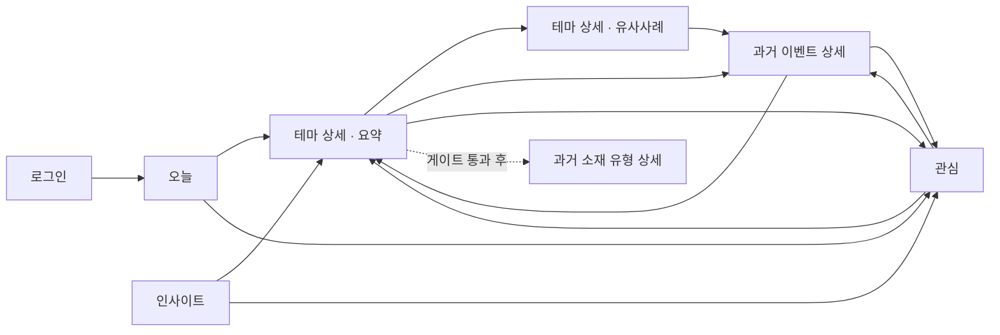

# DAYJAVIEW 화면 명세

- 문서 버전: `1.1`
- 문서 상태: 현재 화면 기준
- 최종 수정일: 2026-08-15
- 대상: 모바일 우선 DAYJAVIEW 사용자 화면
- 제품 범위: [PRD.md](./PRD.md)
- UI 적용 계획: [ui_prototype_adaptation_plan.md](./ui_prototype_adaptation_plan.md)
- API 의미 기준: [api_contract.md](./api_contract.md)
- 화면 참고물: [dayjaview-mockup.html](./dayjaview-mockup.html)

---

## 0. 문서 목적과 적용 규칙

이 문서는 DAYJAVIEW의 최신 정보 구조, 화면 상태, 이동, 표시 문구, 데이터 의미를 한곳에 정의한다. 구현 세부 산식은 기능 명세와 제품 의사결정 문서를 따르되, 사용자에게 무엇을 어떤 의미로 보여줄지는 이 문서를 따른다.

**시각 계층은 이 문서가 결정하지 않는다.** 2026-08-15 제품 결정으로 색·타이포·간격·화면 배치·컴포넌트 외형·탭 표시명은 디자이너 시안이 최상위다. 이 문서는 그 화면에 **어떤 값이 어떤 의미로** 들어가는지를 정의한다. 시안과 이 문서의 배치가 다르면 이 문서를 고친다. 상세 규칙은 [ui_prototype_adaptation_plan.md](./ui_prototype_adaptation_plan.md) §0.1.

현재 HTML 목업은 핵심 여정 검토용이다. 목업의 날짜·종목·수치·랜덤 변화는 예시이며 운영 데이터나 완료된 기능을 의미하지 않는다.

화면 요구사항은 다음 상태로 구분한다.

| 상태 | 의미 |
|---|---|
| 핵심 | 현재 MVP 핵심 여정에 필요 |
| 조건부 | 데이터·품질 게이트 통과 후 노출 |
| 후속 | 진입점은 유지할 수 있지만 상세 범위는 별도 명세 필요 |
| 데모 전용 | 사용자 제품에 포함하지 않음 |

---

## 1. UX 목표

사용자는 홈 진입 후 5초 안에 다음을 파악할 수 있어야 한다.

1. 현재 가장 강한 테마
2. 대표 주도 종목
3. 관련주 전반으로 움직임이 확산됐는지
4. 상승 이유가 확인됐는지 또는 확인 중인지

테마 상세 진입 후 30초 안에는 다음을 파악할 수 있어야 한다.

1. 현재 소재와 근거 상태
2. 평소 대비 거래 관심과 이전 관심 공백
3. 현재 테마 반응과 주도 종목
4. 의미상 관련된 과거 사건과 당시 실제 결과
5. 표본 수, 계산 기준, 데이터 한계

화면은 정보를 많이 보여주는 것보다 **현재 → 근거 → 맥락 → 과거 관측** 순서를 유지하는 것을 우선한다.

---

## 2. 전체 정보 구조

### 2.1 하단 내비게이션

탭 4개다. **표시명은 시안을 따른다.** 이 문서 아래 절들은 편의상 이전 명칭으로 화면을 부르며, 대응은 아래 표와 같다.

| 표시명 (시안) | 이 문서의 명칭 | route | 목적 | 상태 |
|---|---|---|---|---|
| 홈 | 오늘 | `/today` | 현재 강한 테마 발견 | 핵심 |
| 실시간 | 인사이트 | `/insights` | 실시간 테마 상승률 분포 탐색 | 핵심 |
| 즐겨찾기 | 관심 | `/saved` | 저장한 테마·종목·현재/과거 이벤트 | 핵심 |
| 리서치 | — | `/research` | 저장된 사건 기록 자연어 질의 | 요구사항 작성됨([PRD.md](./PRD.md) FR-11·6.2, 이 문서 11.7) — 기능 구현은 E-21 |

- `즐겨찾기` 탭은 핵심 구현 대상이며 비활성 placeholder로 데모하지 않는다.
- `리서치` 탭의 요구사항은 2026-08-15에 작성했다([PRD.md](./PRD.md) FR-11과 6.2 「자연어 리서치 질의」, 이 문서 11.7). **화면 자리와 시각 구성만 C-0에 포함되며 질의·응답 기능은 E-21에서 만든다.** 그전까지 입력창을 동작하는 것처럼 보이게 두지 않는다.
- 이전 명세의 `테마`(전체 탐색·검색) 탭은 시안에 없으므로 **하단 탭에서 제외한다.** 전체 탐색 기능은 후속 범위로 유지한다.

운영자 콘솔은 이 사용자 정보 구조 밖의 별도 `/operator` shell이다. 일반 사용자 하단 내비게이션·검색·sitemap에는 포함하지 않는다.

### 2.2 핵심 화면 목록

| 화면 | 목적 | 상태 |
|---|---|---|
| 로그인 | Google OAuth 진입, 인증 실패·재시도 | 핵심 |
| 오늘 | 강한 테마 카드 목록 | 핵심 |
| 인사이트 | 상승률 기준 실시간 테마 트리맵 | 핵심 |
| 테마 상세 > 요약 | 현재 소재·반응·주도주·과거 요약 | 핵심 |
| 테마 상세 > 유사사례 | 관련 과거 사건의 집계와 목록 | 조건부 — 온톨로지 재검증 후 노출 |
| 과거 이벤트 상세 | 사건별 유사 근거와 실제 결과 | 조건부 — 온톨로지 재검증 후 노출 |
| 테마 상세 > 히스토리 | 해당 테마의 전체 인포스탁 기록 | 후속 |
| 테마 상세 > 관련주 | 현재 테마 구성과 편입 이유 | 후속 |
| 과거 소재 유형 상세 | TOP3 집계에 포함된 사건 목록 | 조건부 |
| 주도 종목 상세 | 사건 당시 개별 종목의 가격 반응 | 후속 |
| 검색 | 테마·종목·과거 사건 검색 | 후속 |
| 관심 | 저장한 테마·종목·현재/과거 이벤트 목록 | 핵심 |
| 리서치 | 저장된 사건 기록 자연어 질의 | 조건부 — 11.7, 기능 구현은 E-21 |

### 2.3 핵심 이동 구조



### 2.4 이동 시 유지할 식별자

- 오늘·인사이트 → 테마 상세: `themeId`, 현재 `eventId`
- 테마 상세 → 과거 이벤트 상세: query `eventId`, 과거 사례 `matchedEventId`
- 뒤로 가기: 사용자가 진입한 화면과 테마 상세 탭 위치 복원
- 장후 분류 변경: 동일한 현재 `eventId` 유지, 확정된 `themeId`와 변경 이력 연결

테마명이나 화면 표시 문자열을 라우팅 식별자로 사용하지 않는다.

### 2.5 인증 진입과 복귀

- 비로그인 사용자는 제품 route에 접근할 수 없으며 로그인 화면으로 이동한다.
- 로그인 화면은 Google 로그인 버튼, 서비스명, 최소 이용 안내, 인증 실패·재시도 상태만 제공한다. 제품 데이터 preview를 포함하지 않는다.
- 로그인 성공 후에는 `APP_BASE_URL=https://dayjaview.vercel.app` 기준으로 검증된 내부 `returnTo`가 있으면 원래 화면으로, 없으면 `오늘`로 이동한다.
- 외부 URL과 protocol-relative URL은 `returnTo`로 허용하지 않는다.
- session 만료 시 현재 URL만 보존하고 화면의 기존 제품 데이터를 제거한 뒤 로그인 화면으로 이동한다.
- 로그아웃 시 client cache와 메모리 snapshot을 지우고 로그인 화면으로 이동한다.

---

## 3. 공통 화면 구조

### 3.1 기본 레이아웃

모바일 우선 단일 열을 기본으로 한다.

```text
상단 제목·행동
데이터 기준 시각·시장 상태
화면별 핵심 콘텐츠
보조 설명 또는 계산 기준
하단 내비게이션
```

- 화면 제목은 현재 위치를 명확히 표시한다.
- 검색·관심·공유처럼 부가 행동은 핵심 데이터보다 시각적으로 약하게 둔다.
- 테마 상세와 과거 이벤트 상세에서는 상단 뒤로 가기를 제공한다.
- 고정 하단 내비게이션이 콘텐츠나 버튼을 가리지 않게 안전 영역을 확보한다.

### 3.2 데이터 상태 표시

모든 실시간 화면 상단에는 기준 시각과 데이터 상태를 표시한다.

| 내부 상태 | 사용자 표현 | 동작 |
|---|---|---|
| PREOPEN | 장 시작 전 | 전일 확정값 또는 대기 상태 표시 |
| LIVE | 실시간 · 방금 업데이트 | 정상 갱신 |
| DELAYED | 수신 지연 · 마지막 정상 시각 | 마지막 정상값 유지 |
| DEGRADED | 일부 데이터 지연 | 영향 범위와 Coverage 표시 |
| CLOSED | 장 마감 · 장후 확정 또는 확정 대기 | 최종값 고정 |

`LIVE`는 정밀 구독 중인 활성 테마의 수초 단위 준실시간을 의미한다. 전 종목의 모든 틱을 전수 처리한다는 의미로 설명하지 않는다.

### 3.3 숫자 형식

- 수익률: 부호 포함 소수점 1자리, 예 `+2.7%`, `−0.8%`
- 표본: `10 / 14건 상승`처럼 분자와 분모를 함께 표시
- 종목 확산: `17 / 21종목 상승`
- 거래 관심: `평소의 2.4배`
- 관심 공백: `163거래일`, 보조 문구에 개월 환산 허용
- 시각: 장중 `HH:mm`, 과거 사건일 `YYYY.MM.DD`
- 계산 불가: `—` 또는 상태 문구. `0`으로 대체하지 않음

소수점 자릿수는 화면 안에서 일관되게 유지한다. 내부 원값을 반올림한 경우 계산 기준에서 이를 알린다.

### 3.4 계산 기준

복잡한 지표 옆에는 `계산 기준` 진입점을 제공한다. 모바일에서는 바텀시트를 기본으로 사용한다.

바텀시트는 다음을 포함한다.

- 값이 답하는 질문
- 계산 대상과 기간
- 가중 방식 또는 중앙값 여부
- 데이터 기준 시각
- 주요 제외·결측 규칙
- 예측이 아닌 경우 해당 고지

설명을 닫은 뒤 원래 초점 위치로 돌아간다.

### 3.5 테마 수익률 명명 규칙

- 사용자 화면의 지표명은 모든 화면에서 **`테마 수익률`**로 고정한다.
- 홈 카드, 테마 상세, 트리맵, 검색 결과와 도움말 진입점에서 다른 이름으로 바꾸지 않는다.
- `가중 수익률`, `대형주 반영 수익률`, `시총 상한 가중 수익률`은 사용자 지표명으로 사용하지 않는다.
- 계산 기준 바텀시트에서만 산식을 **`전일 기준 상한형 유동시가총액 가중`**으로 설명한다.
- 검증된 유동주식비율이 없으면 다른 산식명으로 바꾸지 않고 `데이터 갱신 중` 또는 `계산할 수 없음` 상태를 표시한다.

---

## 4. 공통 상태 모델

### 4.1 테마 이벤트 상태

| 내부 상태 | 화면 처리 |
|---|---|
| CANDIDATE | 홈 기본 목록에는 미노출, 필요하면 탐색 중 상태로 운영 화면에만 표시 |
| ACTIVE | 홈·인사이트 정상 노출 |
| WEAKENING | 약화 상태를 보조 배지·스타일로 표시, 즉시 제거하지 않음 |
| CLOSED | 장후 최종값 고정 |

`급부상`은 현재 순위와 다른 개념이다. 짧은 시간의 순위 상승을 나타내는 보조 배지로만 사용한다.

### 4.2 상승 이유 상태

| 내부 상태 | 화면 문구 | 허용 표현 |
|---|---|---|
| SEARCHING | 상승 이유 확인 중 | 원인 단정 금지 |
| SINGLE_SOURCE | 뉴스 기반 추정 | 매체·시각·원문 제공 |
| MULTI_SOURCE_CONFIRMED | 복수 뉴스 확인 | 확인된 보도 범위 안에서 요약 |
| NO_NEW_CATALYST | 확인된 신규 소재 없음 | 기사 부재와 수집 장애를 내부적으로 구분 |
| REEMERGENCE | 기존 소재 재부각 | 이전 소재와의 연결 근거 제공 |
| AFTER_CLOSE_CONFIRMED | 인포스탁 기준 확정 | 장중 표현과 달라진 경우 이력 제공 |

근거 상태는 색상만으로 구분하지 않고 텍스트로 표시한다.

### 4.3 분류 상태

| 상태 | 화면 처리 |
|---|---|
| 기존 인포스탁 테마 | 일반 테마명 사용 |
| 미분류 동반 상승 | 이름을 억지로 만들지 않고 그대로 표시 |
| 임시 테마 | `신규·임시` 배지 표시 |
| 운영자 검수 | 사용자 기본 화면에서는 마지막 승인 상태 유지 |
| 장후 확정 | 확정 테마명을 기본 표시, 장중 이름은 이력에 보존 |
| UNMATCHED | 확정 대기 상태 표시, 과거 통계 자동 연결 금지 |

### 4.4 Coverage 상태

| 상태 | 처리 |
|---|---|
| 충분 | 정상 수치와 순위 표시 |
| 부분 | 확보 종목 수와 `데이터 갱신 중` 표시, 확산 해석 주의 |
| 미달 | 순위·트리맵에서 제외하거나 값 대신 상태 표시 |

Coverage가 낮은 테마를 0% 테마로 표시하지 않는다.

---

## 5. 오늘 화면

### 5.1 목적

현재 시장에서 강한 테마를 발견하고 테마 상세로 진입하게 한다.

### 5.2 상단

- 제목: `오늘`
- 날짜
- 시장 상태: `장 시작 전`, `실시간`, `수신 지연`, `장후 확정`, `확정 대기`
- KOSPI·KOSDAQ 등락은 기준 시각이 같을 때만 보조 정보로 표시
- 검색 진입점은 후속 검색 기능이 준비된 경우에만 활성화

### 5.3 장중 기본 구조

```text
오늘
기준 시각 · 데이터 상태
시장 지수

지금 강한 테마
테마 카드 목록
```

### 5.4 테마 카드

필수 정보 순서는 다음과 같다.

1. 현재 순위
2. 테마명
3. 상태 배지: 급부상, N개월 만에 재점화, 신규·임시, 약화 등 최대 1개 우선 표시
4. 테마 수익률
5. 상승 이유 요약과 근거 상태
6. 대표 주도주와 개별 수익률
7. 상승 종목 수 / 유효 종목 수
8. 마지막 갱신 시각

선택 정보:

- 온톨로지 재검증 게이트를 통과한 검색 결과가 준비된 경우 `과거 관측`이라는 맥락과 함께 유사사례 한 줄 요약
- 예: `과거 비슷한 14건 중 다음날 10건 상승`

이 선택 정보는 홈 순위에 영향을 주지 않으며 현재 사건의 상승 가능성처럼 강조하지 않는다.

### 5.5 카드에서 제외할 정보

- 내부 Theme Score
- 수치 유사도
- T+5·T+20 전체 표
- MFE·MAE
- 전체 거래대금 원값
- 장문의 뉴스 요약
- 여러 개의 경쟁 배지
- 매수·매도 문구

### 5.6 카드 상태 예시

정상:

```text
1  원전수출                         급부상
체코 신규 원전 관련 보도
뉴스 기반 추정 · 10:18
두산에너빌리티 +14.2%
대형주 반영 +2.7% · 17 / 21종목 상승
2초 전 갱신
```

이유 미확인:

```text
미분류 동반 상승                   신규
상승 이유 확인 중
관련주 4개 · 3분 동반 강세
```

Coverage 부족:

```text
전력설비
데이터 갱신 중
현재 11 / 18종목 반영
```

### 5.7 시간대별 상태

#### 장 시작 전

- `장 시작 전` 표시
- 실시간 순위 대신 전일 확정 요약 또는 skeleton 표시
- 전일 수치를 오늘 값처럼 보이지 않게 날짜를 강조

#### 장중

- ACTIVE·WEAKENING 테마를 순위 기준으로 표시
- 변경분을 수초 단위로 반영
- 지연 시 마지막 정상값과 시각 유지

#### 장 마감 후

- 장중 최종값을 고정
- 인포스탁 반영 전에는 `장후 확정 대기`
- 반영 후 `장후 확정`
- 분류가 바뀌면 기본 카드에는 확정명을 사용하고 상세에서 변경 이력 제공

### 5.8 상호작용

- 카드 전체 선택 → 해당 `themeId`, `eventId`의 테마 상세 요약
- 키보드 Enter·Space와 터치가 같은 동작 수행
- 목록 갱신 중 사용자가 읽는 카드의 초점을 빼앗지 않음

---

## 6. 인사이트 화면

### 6.1 목적

정밀 추적 중인 활성 테마의 상승률 분포를 한눈에 보여준다.

### 6.2 화면 구조

```text
인사이트
기준 시각 · 데이터 상태

실시간 테마 맵
상승률 기준 · 색상 범례
트리맵
상태 설명
```

### 6.3 트리맵 규칙

- 사용자 지표명은 `테마 수익률` 하나만 사용하며, 내부 계산은 상한형 유동시가총액 가중을 따른다.
- 지표 토글을 제공하지 않는다.
- 표시 대상은 Core Coverage를 통과하고 `weightedReturn > 0`인 ACTIVE·WEAKENING 테마 상위 12개다.
- 면적은 상승률 원값에 비례한다.
- 색상은 상승률 방향과 크기를 나타낸다.
- 타일에는 가능한 경우 테마명과 상승률을 함께 표시한다.
- 작은 타일에서 텍스트가 생략돼도 접근성 이름에는 테마명과 상승률을 포함한다.
- 내부 복합 순위 점수, 거래대금, 랜덤값을 면적에 사용하지 않는다.

### 6.4 갱신

- 숫자·색상은 최대 500ms 단위로 최신 스냅샷 반영
- 레이아웃은 최대 1초에 한 번 갱신
- 값이 변하지 않으면 불필요한 재배치·애니메이션 금지
- 이전 sequence는 무시
- 재연결 후 전체 스냅샷으로 교체
- reduced motion 환경에서는 전환 애니메이션 제거

### 6.5 화면 상태

| 조건 | 표시 |
|---|---|
| 첫 스냅샷 대기 | 트리맵 skeleton |
| 표시 가능한 테마 없음 | `현재 조건을 충족한 테마가 없습니다` |
| 3초 이상 stale | 마지막 정상 화면 + `수신 지연` |
| 연결 복구 | 새 전체 스냅샷으로 교체 |
| Coverage 미달 | 해당 테마 제외, 0% 타일 생성 금지 |
| 장 마감 | 최종 화면 고정 + `장 마감` |

### 6.6 상호작용

- 타일 전체 선택 → 테마 상세 요약
- 타일은 링크 또는 버튼의 올바른 의미 요소로 구현
- 선택 시 `themeId`, `eventId` 유지

---

## 7. 테마 상세 공통

### 7.1 상단

- 이전 화면으로 돌아가기
- 테마명
- 현재 Event의 기준 시각·상태
- 관심 등록·해제를 제공하고 mutation 진행 중에는 중복 입력을 막으며 실패 시 이전 상태로 복구

### 7.2 탭

| 탭 | 상태 | 설명 |
|---|---|---|
| 요약 | 핵심 | 현재 판단에 필요한 핵심 정보 |
| 유사사례 | 조건부 | 온톨로지 구축·2인 관련성 검수·새 봉인 구간 재검증 후 노출 |
| 히스토리 | 후속 | 해당 테마의 전체 인포스탁 사건 기록 |
| 관련주 | 후속 | 현재 구성종목과 편입 이유 |

후속 탭을 목업에서 비활성화할 수 있으나, 운영 화면에서는 선택 가능한 빈 탭으로 노출하지 않는다.

### 7.3 탭 상태 유지

- 과거 이벤트 상세에서 돌아오면 이전 탭과 스크롤 위치를 복원한다.
- 같은 테마에서 장중 데이터가 갱신돼도 사용자의 탭을 강제로 바꾸지 않는다.
- 장후 분류 변경으로 테마가 병합되면 안내 후 확정 테마의 동일 탭으로 연결한다.

---

## 8. 테마 상세 > 요약

### 8.1 정보 순서

1. 현재 테마 반응
2. 오늘 부각된 이유
3. 관심 공백과 거래 관심
4. 현재 움직임
5. 주도 종목
6. 과거 테마 반응 소재 TOP3 — 게이트 통과 시에만
7. 과거 유사사례 요약
8. 가장 관련된 과거 사례

### 8.2 현재 테마 반응

```text
방산                               +4.9%
대형주 반영 · 관련주 15 / 21 상승
[계산 기준]
```

- 테마 수익률과 상승 종목 수를 항상 함께 표시한다.
- 유동시총 대체값을 사용하면 `유동시총` 표현 대신 실제 방식에 맞는 문구를 사용한다.
- 내부 순위 점수는 표시하지 않는다.

### 8.3 오늘 부각된 이유

```text
오늘 부각된 이유
중동 분쟁 확산으로 국내 방산기업 수출 확대 관련 보도
뉴스 기반 추정 · 최초 확인 10:08
```

- 요약은 근거 기사 범위를 넘는 인과를 추가하지 않는다.
- 출처 목록은 영역 선택 또는 별도 상세에서 매체·발행 시각·원문 링크로 제공한다.
- SEARCHING 상태에서는 설명 문장 대신 `상승 이유 확인 중`을 표시한다.

### 8.4 관심 공백과 거래 관심

장기 미관심 상태가 확인된 경우 다음처럼 표시한다.

```text
8개월 만에 다시 주목받고 있어요
이전 관심 구간 마지막 주목일 2025.12.03

관심 공백        163거래일
오늘 거래 관심   평소의 2.4배
```

- 홈 배지는 관심 공백 60거래일 이상인 활성 테마에만 조건부 표시한다.
- 관심 공백은 가격 저점이나 저평가를 뜻하지 않는다.
- 유효 구성종목이 부족하면 `데이터 부족`으로 표시한다.

### 8.5 현재 움직임

기본 항목:

- 시장 테마 순위
- 거래 관심 증가 종목 수 / 유효 종목 수
- 확산 상태: `대형주 주도`, `관련주 전반으로 확산` 등
- 필요한 경우 시장 대비 초과 반응

상태 임계값이 검증 전이면 확정된 사실처럼 고정 문구를 사용하지 않는다.

### 8.6 주도 종목

- 현재 주도 종목 상위 3개를 기본 노출한다.
- 종목명과 현재 수익률을 표시한다.
- 첫 번째 종목에만 `주도` 보조 라벨을 허용한다.
- 각 종목 행에 관심 저장·해제 action을 제공하되 행의 상세 이동과 클릭 영역을 분리한다.
- 주도주 선정 로직은 테마 수익률과 별도다.
- 종목 상세가 준비되지 않았다면 종목 행을 잘못된 링크로 만들지 않는다.

### 8.7 과거 테마 반응 소재 TOP3

이 영역은 [historical_theme_catalyst_top3_feature_spec.md](./historical_theme_catalyst_top3_feature_spec.md)의 데이터·안정성 게이트를 통과한 경우에만 표시한다.

```text
과거 원전 테마 반응 TOP3
인포스탁 히스토리에 기록된 사례 기준

1  해외 원전 수주 단계 진전
   12건 · 당일 중앙 반응 +6.4%
   오늘과 같은 유형
```

규칙:

- 유효 유형이 1~2개면 `TOP3`라는 표현을 사용하지 않는다.
- 유효 유형이 0개면 임의 항목을 만들지 않는다.
- `오늘과 같은 유형`은 동일 수익률이나 미래 상승을 의미하지 않는다.
- 계산 기준에 당시 주도주 동일가중, T-1→T0, 중앙값, 미래 예측 아님을 설명한다.

### 8.8 과거 유사사례 요약

이 영역은 M-TXT v1을 기준선으로 온톨로지 구조 매칭과 혼합 방식을 다시 비교하고, 새 미사용 봉인 구간을 통과한 엔진 버전이 있을 때만 일반 사용자에게 표시한다.

```text
비슷했던 과거 14건
오늘과 사건 원인문이 관련된 사례

다음날      10 / 14건 상승   중앙 +3.8%
5거래일      9 / 14건 상승   중앙 +8.2%
20거래일     6 / 12건 상승   중앙 +4.1%
```

규칙:

- 기간별 유효 분모를 별도로 표시한다.
- `대표`를 사용한다면 같은 화면의 계산 기준에서 중앙값임을 명시한다. 기본 라벨은 `중앙`이다.
- 상승 빈도를 확률·성공률·적중률로 바꾸지 않는다.
- 표본 부족 경고를 요약 가까이에 표시한다.
- `과거 관측 요약이며 미래 수익률 예측이 아닙니다`를 계산 기준에 포함한다.

### 8.9 가장 관련된 과거 사례

- 관련 사례 Top5를 세로 목록 또는 가로 카드로 제공한다.
- 카드 필수값: 사건일, 사건 요약, `왜 비슷한지` 태그, 선택된 대표 기간의 실제 결과
- 수치 유사도는 표시하지 않는다.
- 카드 선택 → 과거 이벤트 상세

---

## 9. 테마 상세 > 유사사례

### 9.1 목적

요약보다 더 많은 표본과 사건별 근거를 검토하게 한다.

이 화면 전체는 과거 유사사례 온톨로지 재검증 게이트에 종속된다. 게이트 전에는 공개 사용자 화면에 v1 결과를 최종 결과처럼 노출하지 않는다.

### 9.2 상단 집계

- 엄격 일치 사례 수
- 부분 일치 사례가 지원되는 경우 별도 수
- T+1·T+5·T+20 기간별 유효 표본 수
- 기간별 상승 사건 수와 중앙 수익률
- 표본·누락·point-in-time 품질 경고

엄격 일치와 부분 일치를 한 분모로 조용히 합치지 않는다.

### 9.3 사례 목록

각 항목에 다음을 표시한다.

- 사건일과 테마명
- 사건 요약
- 공유 토큰 또는 구조 태그
- 당시 주도주
- T+1·T+5·T+20 중 선택된 기간의 실제 결과
- 데이터 품질 상태

기본 정렬은 엔진의 관련성 순서를 따른다. 미래 수익률로 재정렬하는 기능은 제공하지 않는다.

### 9.4 필터와 정렬

MVP에서 허용:

- 기간 표시 전환: T+1 / T+5 / T+20
- 엄격 / 부분 사례가 구현된 경우 범위 전환

MVP에서 금지:

- 수익률 높은 순으로 기본 정렬
- 미래 결과를 사용한 유사도 재계산
- 표본 수를 숨기는 필터

### 9.5 표본 부족

```text
같은 유형 과거사례 2건
표본이 적어 참고용이에요
```

사례가 0건이면 넓은 부분 유사사례가 검증된 경우에만 별도 영역으로 제공한다. 그렇지 않으면 `동일 유형 과거사례 없음`을 표시한다.

---

## 10. 과거 이벤트 상세

### 10.1 목적

한 과거 사건이 왜 관련됐으며 당시 실제로 어떤 결과가 있었는지 검증하게 한다.

### 10.2 정보 순서

1. 사건일·테마·사건 요약과 이벤트 저장·해제
2. 오늘과 비슷한 이유
3. 데이터가 안전한 경우 발생 전 상태
4. 당시 주도주 바스켓 결과
5. T+1·T+5·T+20 결과
6. 당시 주도 종목별 결과
7. 계산 기준과 데이터 한계

### 10.3 오늘과 비슷한 이유

- 공유 토큰 또는 구조 태그를 표시한다.
- 예: `중동`, `분쟁 확대`, `방산 수요`, `국내기업 수혜`
- 보정되지 않은 `93% 유사` 같은 숫자는 사용하지 않는다.
- 태그가 단순 문자열 일치인지 구조화된 속성인지 계산 기준에서 구분한다.

### 10.4 발생 전 상태

point-in-time 안전한 필드만 표시한다.

예:

- 직전 5거래일 바스켓 수익률
- 직전 20거래일 바스켓 수익률
- 이전 관심 이후 거래일

과거 장중 분봉이 없으면 현재 장중 경로와 동일 조건인 것처럼 비교하지 않는다.

### 10.5 당시 결과

```text
사건 당일 · 당시 주도주 바스켓
+12.4%

다음날      +1.2%
5거래일     +3.1%
20거래일    +5.8%
```

- 바스켓은 사건 당시 인포스탁이 기록한 주도주를 동일가중한다.
- 현재 관련주를 과거에 소급하지 않는다.
- 가격이 없는 종목은 제외 사유와 유효 종목 수를 제공한다.
- 관찰이 끝나지 않은 기간은 `관찰 중`으로 표시한다.

### 10.6 종목별 결과

- 당시 주도주 이름과 선택 기간 실제 수익률 표시
- 상장폐지·종목명 변경·가격 누락 상태 표시
- 바스켓에서 제외된 종목을 조용히 숨기지 않음

### 10.7 하단 고지

```text
미래 결과는 유사사례를 고를 때 사용하지 않았습니다.
사례를 먼저 선택한 뒤 당시 실제 가격 결과를 연결했습니다.
```

---

## 11. 보조·조건부·후속 화면

### 11.1 과거 소재 유형 상세

TOP3 게이트 통과 후에만 제공한다.

- 소재 유형명
- 집계에 포함된 사건 목록
- 사건일·정규화 요약·당일 반응·당시 주도주
- 중앙 반응과 유효 표본 수
- 데이터 품질 상태

수익률이 높은 사건만 골라 보여주지 않는다.

### 11.2 테마 상세 > 히스토리

후속 범위다. 구현 시 인포스탁 전체 히스토리를 날짜순으로 탐색하되, 유사사례와 혼동하지 않게 다음을 구분한다.

- 히스토리: 해당 테마의 전체 기록
- 유사사례: 현재 사건과 관련성 기준을 통과한 과거 기록

### 11.3 테마 상세 > 관련주

후속 범위다. 구현 시 현재 membership 버전 기준 종목과 편입 이유를 표시한다. 과거 사건 당시 주도주와 같은 목록으로 표현하지 않는다.

### 11.4 검색

후속 범위다. 테마·종목·과거 사건을 결과 유형별로 구분하고, 검색 결과가 현재 활성 이벤트인지 과거 기록인지 명확히 표시한다.

### 11.5 관심

핵심 구현 범위다. route 후보는 `/saved`이며 Google 계정의 저장 목록을 사용한다.

정보 구조:

1. 상단 제목 `관심`
2. 유형 필터 `전체 / 테마 / 종목 / 이벤트`
3. 저장 항목 목록
4. 계정 메뉴의 저장 데이터·계정 삭제

공통 항목:

- 대상 유형과 이름
- 저장 시각
- 현재 상태와 마지막 변경 시각
- 연결 가능한 원래 상세 화면
- 저장 해제

유형별 표시:

- 테마: 현재 활성 Event, 순위·등락·Coverage 상태, 마지막 정상 시각
- 종목: 현재가·등락률·소속 활성 테마, 데이터 지연 상태
- 이벤트: 현재/과거 구분, 거래일, 상태·확정 분류, 접근 가능 여부

표시 규칙:

- 저장 여부는 서버 session의 사용자 ID로 조회하며 브라우저 local storage를 기준 저장소로 사용하지 않는다.
- 저장·해제는 optimistic UI를 사용할 수 있으나 실패하면 이전 상태로 되돌리고 재시도 행동을 제공한다.
- 중복 저장은 한 항목으로 보이며 저장 순서 정렬을 기본으로 한다.
- 대상이 비활성·삭제·권한 제한이면 다른 대상으로 바꾸지 않고 `현재 확인할 수 없음`과 이유를 표시한다.
- 과거 이벤트는 유사사례 출시 게이트와 entitlement를 통과한 경우에만 상세로 이동한다.
- 빈 상태는 `저장한 항목이 없습니다`와 오늘·인사이트로 이동하는 행동을 제공한다.
- 이메일·SMS·Web Push 알림은 제공하지 않는다.
- 증권계좌·보유종목·주문 정보와 연결하지 않는다.

계정 삭제는 확인 dialog에서 삭제 대상을 명시하고 재인증이 필요한 경우 Google 로그인을 다시 요구한다. 완료 후 session과 client cache를 폐기하고 로그인 화면으로 이동한다.

### 11.6 내부 운영자 콘솔

일반 사용자 제품과 분리된 내부 화면이다. `OPERATOR` 역할이 없는 사용자는 route를 알아도 서버 API에서 `403`으로 차단하며 사용자 내비게이션에는 링크를 표시하지 않는다.

화면 구성:

1. 운영 상태 대시보드
   - 배포 버전과 process 상태
   - 키움·뉴스·인포스탁별 마지막 성공 시각과 현재 작업 상태
   - `RATE_LIMITED`, `AUTH_REQUIRED`, `DEGRADED`, `FAILED`
2. 작업 실행 목록
   - `runId`, 작업 유형, 시작·종료 시각, cursor, 성공·실패 건수
   - 허용된 작업의 재시도·재개와 실행 결과
3. 검수 대기열
   - 장중·장후 분류 불일치와 `UNMATCHED`
   - 뉴스 근거 후보와 미매칭 Event
   - 병합·분리·제외 제안
4. 변경 이력
   - 수행자, 시각, 대상, 사유, 이전/이후 revision
5. 인포스탁 인증 상태
   - `AUTH_REQUIRED` 여부와 마지막 정상 인증 시각
   - SSH tunnel 기반 수동 재인증 runbook 진입

운영 action 규칙:

- 위험한 command는 대상·효과·사유를 확인하는 dialog를 사용한다.
- mutation 중 중복 실행을 막고 성공·실패를 해당 `runId` 또는 audit ID와 함께 표시한다.
- 분류 수정·병합·제외는 hard delete나 원본 덮어쓰기가 아니라 새 revision을 만든다.
- 브라우저에서 서버 terminal을 제공하지 않는다.
- secret, cookie, token, SSH private key, 네이버·키움 credential 원문을 표시하거나 수정하지 않는다.
- 인포스탁 인증 UI·VNC port를 public internet에 열지 않는다.

### 11.7 리서치 (자연어 질의)

route `/research`. 요구사항은 [PRD.md](./PRD.md) FR-11과 6.2 「자연어 리서치 질의」다. **C-0에서는 화면 자리와 시각 구성만 만들고, 질의·응답 동작은 E-21에서 구현한다.**

#### 진입 상태

- 빈 입력창만 두지 않는다. 답할 수 있는 **예시 질문 6~8개**를 카드로 함께 노출한다. 이 목록이 현재 답변 가능 범위의 선언이며, 단계(1·2·3)가 열릴 때마다 갱신한다.
- 아직 열리지 않은 단계의 질문 예시는 노출하지 않는다.

#### 답변 카드 구성

질의 유형별로 화면을 따로 만들지 않는다. 아래 블록의 조합으로 모든 답변을 구성한다.

| 블록 | 내용 | 규칙 |
|---|---|---|
| 해석 | 질문에서 뽑은 테마·종목·기간·소재 유형·방향 | 항상 표시. 사용자가 고쳐 재질의 가능 |
| 요약 문장 | 한 문장 | LLM이 쓰되 수치는 계산 결과를 주입. LLM이 수치를 만들지 않는다 |
| 수치 요약 | 건수·기간·대상 수 | **표본 수를 반드시 포함**한다 |
| 근거 사건 목록 | 날짜·테마·원인문·당시 주도주 | 항목에서 테마 상세·과거 이벤트 상세로 이동 |
| 미제시 사유 | 계산하지 못한 값과 이유 | 값이 없는데 비워두지 않는다 |

- 수치 요약과 근거 목록이 비면 요약 문장만 남는다. 이 경우도 같은 카드 형식을 쓴다.
- 답변은 위로 쌓이며 이전 질의를 화면에서 유지한다. 직전 슬롯을 이어받을 때는 해석 블록에 그 사실이 보여야 한다.

#### 답할 수 없을 때

12절 오류·빈 상태 규칙을 따르되, 사유를 세 가지로 구분해 문구를 다르게 한다.

| 사유 | 표시 | 다음 행동 |
|---|---|---|
| 기록 없음 | 해당 기간·대상에 저장된 사건이 없다고 명시 | 조회 범위를 넓히는 선택지 제시 |
| 질문 해석 실패 | 어떤 낱말을 해석하지 못했는지 지목 | 후보 목록을 제시해 고르게 함 |
| 제품 범위 밖 | 미래 예측·매매 판단은 제공하지 않는다고 명시 | 대신 제공 가능한 과거 관측 질문을 제안 |

#### 문구

- 13절 문구 원칙을 따른다. 모든 답변은 **과거 관측 시제**로 쓰고 전망·권유 표현을 쓰지 않는다.
- 표본이 작을 때(기준은 E-21에서 확정) 표본 수를 강조해 함께 보여준다.

---

## 12. 오류·빈 상태·예외

| 상황 | 사용자 처리 |
|---|---|
| 비로그인·session 만료 | 제품 데이터 제거 후 Google 로그인 화면, 로그인 성공 뒤 안전한 원래 경로 복귀 |
| Google 로그인 실패·취소 | 실패 사유를 과도하게 노출하지 않고 다시 로그인 |
| 활성 테마 없음 | `현재 조건을 충족한 테마가 없습니다` |
| 첫 데이터 대기 | 화면 구조를 유지한 skeleton |
| 전체 연결 지연 | 마지막 정상값 + `수신 지연` + 정상 시각 |
| 일부 종목 Coverage 부족 | 반영 종목 수와 `데이터 갱신 중` |
| 상승 이유 없음 | `상승 이유 확인 중` 또는 `확인된 신규 소재 없음` |
| 뉴스 수집 장애 | 원인 미확정 유지, 운영 상태와 기사 부재를 내부 구분 |
| 유사사례 0건 | `동일 유형 과거사례 없음` |
| 유사사례 소수 | 실제 표본 표시 + 참고용 경고 |
| 기간별 가격 누락 | 해당 기간 분모 축소, 누락 사유 확인 가능 |
| 과거 관찰 미완료 | `관찰 중` |
| 인포스탁 확정 지연 | `장후 확정 대기` |
| 장중·장후 분류 변경 | 확정명 기본 표시 + 변경 이력 제공 |
| 계산 불가 | `—`와 설명, 0 표시 금지 |

오류 상태에서도 날짜·대상 테마·마지막 정상값을 가능한 한 보존해 사용자가 맥락을 잃지 않게 한다.

---

## 13. 문구 원칙

### 13.1 사용한다

- 지금 강한 테마
- 관련주 17 / 21종목 상승
- 상승 이유 확인 중
- 뉴스 기반 추정
- 복수 뉴스 확인
- 인포스탁 기준 확정
- N개월 만에 재점화
- 비슷했던 과거 14건
- 14건 중 10건 상승
- 중앙 수익률 +3.8%
- 표본이 적어 참고용이에요
- 과거 관측 요약

### 13.2 사용하지 않는다

- 테마 강도 92점
- 상승 확률 71%
- 성공률 80%
- 다음날도 갈 가능성이 높음
- 예상 수익률
- 추천 종목
- 93% 유사
- 확정 근거 없이 `~로 상승`
- 결측·지연 값을 `0%`

### 13.3 한국 시장 색상

상승·하락 색상은 서비스 디자인 토큰을 일관되게 사용한다. 색상만으로 방향을 전달하지 않고 부호와 텍스트를 함께 표시한다.

---

## 14. 접근성과 반응형

- 본문과 핵심 수치는 WCAG AA 수준의 대비를 목표로 한다.
- 모든 아이콘 버튼에 접근 가능한 이름을 제공한다.
- 탭은 올바른 tablist·tab·tabpanel 관계와 키보드 이동을 지원한다.
- 트리맵 타일과 카드 전체를 키보드로 선택할 수 있게 한다.
- 포커스 표시를 제거하지 않는다.
- 실시간 갱신이 스크린리더에 과도하게 반복 안내되지 않도록 중요한 상태 변화만 알린다.
- 수치 갱신으로 레이아웃이 크게 흔들리지 않게 tabular numerals를 사용한다.
- reduced motion 환경에서는 전환 애니메이션을 제거한다.
- 작은 화면에서 가로 스크롤이 생기지 않게 하되, 사례 카드의 의도된 가로 목록은 스냅과 명확한 힌트를 제공한다.
- 터치 대상은 최소 44×44px를 목표로 한다.

---

## 15. 화면 이벤트 측정

최소 다음 이벤트를 수집한다. 개인의 매매 결과나 주문 행동을 추적하는 용도로 확장하지 않는다.

- 오늘 화면 노출
- 테마 카드 선택
- 인사이트 타일 선택
- 테마 상세 탭 전환
- 계산 기준 열기
- 뉴스 원문 열기
- 유사사례 목록 진입
- 과거 이벤트 상세 열기
- 표본 부족·지연 상태 노출
- 장중 분류 변경 이력 열기

모든 이벤트에는 화면, `themeId`, `eventId`, 데이터 상태, 기준 시각, 앱 버전을 포함한다. 민감한 사용자 데이터는 최소화한다.

---

## 16. 화면 검수 체크리스트

### 공통

- [ ] 모든 실시간 화면에 데이터 상태와 기준 시각이 있다.
- [ ] 결측·지연·Coverage 부족이 0으로 표시되지 않는다.
- [ ] 뒤로 가기와 탭·스크롤 복원이 일관된다.
- [ ] 계산 기준을 키보드와 터치로 열고 닫을 수 있다.
- [ ] 예측·추천으로 오인되는 문구가 없다.

### 오늘

- [ ] 5초 안에 테마명·주도주·확산·이유 상태를 파악할 수 있다.
- [ ] 테마 수익률과 상승 종목 수가 함께 표시된다.
- [ ] 내부 점수와 장기 통계가 카드를 압도하지 않는다.
- [ ] 이유 미확인과 장후 확정 상태가 구분된다.

### 인사이트

- [ ] 상승률 단일 기준이며 지표 토글이 없다.
- [ ] 실제 입력이 없을 때 타일이 임의로 움직이지 않는다.
- [ ] stale·Coverage·장 마감 상태가 구분된다.
- [ ] 타일 선택 시 동일 Event의 테마 상세로 이동한다.

### 테마 상세

- [ ] 현재 정보와 과거 관측이 시각적으로 구분된다.
- [ ] 관심 공백이 가격 저점처럼 표현되지 않는다.
- [ ] 과거 기간별 분모와 중앙값 의미가 보인다.
- [ ] 수치 유사도 대신 왜 비슷한지 근거가 제공된다.
- [ ] M-TXT·온톨로지·혼합 비교와 새 봉인 구간 재검증을 통과한 엔진 버전을 사용한다.
- [ ] TOP3 영역은 데이터 게이트 통과 전 노출되지 않는다.

### 과거 이벤트 상세

- [ ] 당시 주도주와 현재 관련주를 혼동하지 않는다.
- [ ] 미래 결과가 사례 선택에 쓰이지 않았다는 설명이 있다.
- [ ] 가격 누락·관찰 중·표본 부족 상태가 정확하다.
- [ ] 모든 예시 데이터가 운영 데이터와 구분된다.

이 체크리스트를 통과하지 않은 화면은 목업 완성 여부와 관계없이 출시 준비 완료로 간주하지 않는다.
