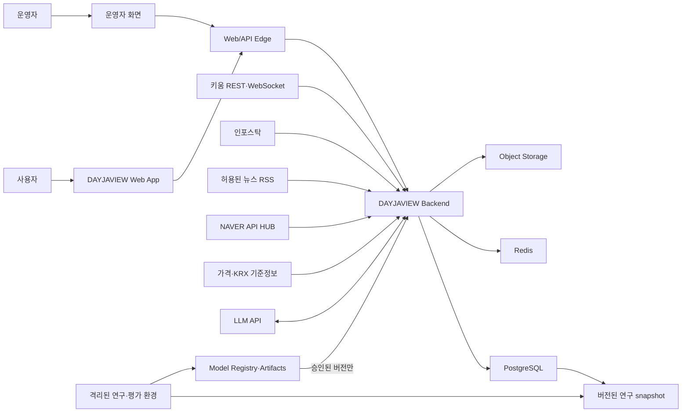
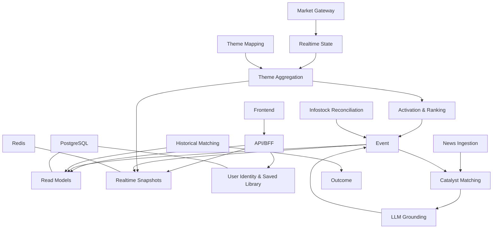
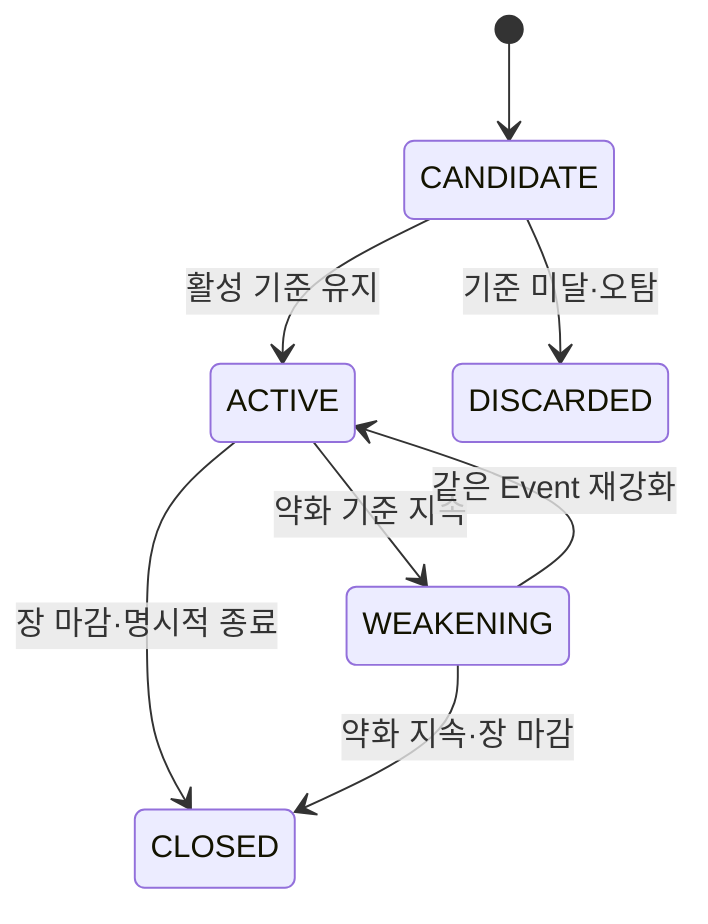
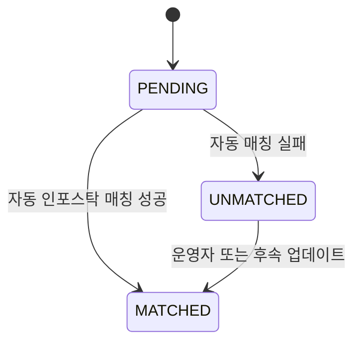
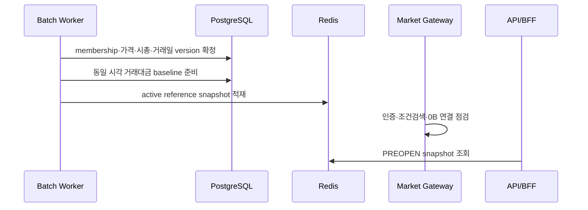
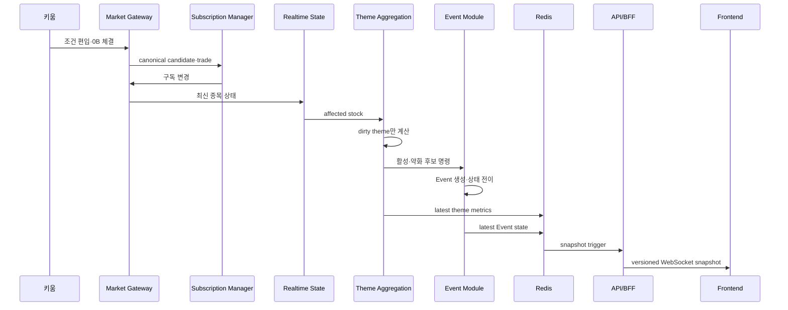
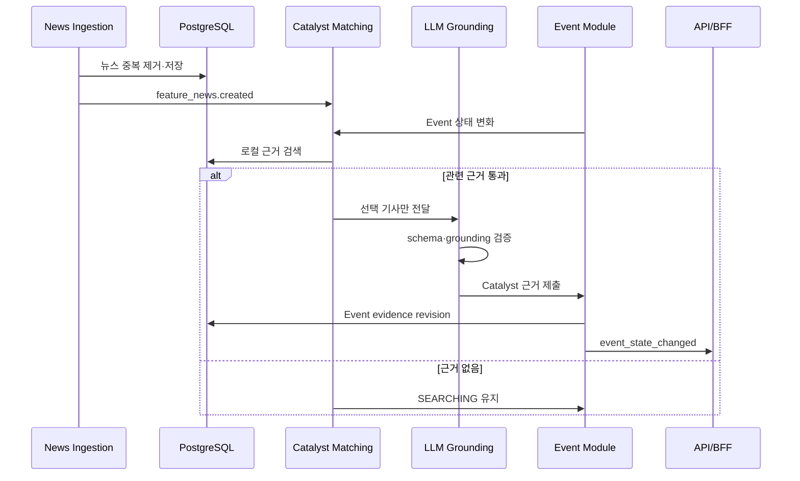
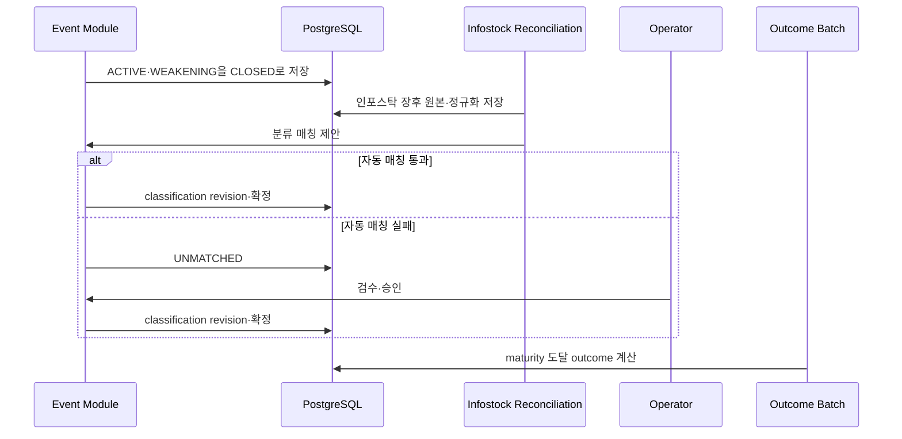
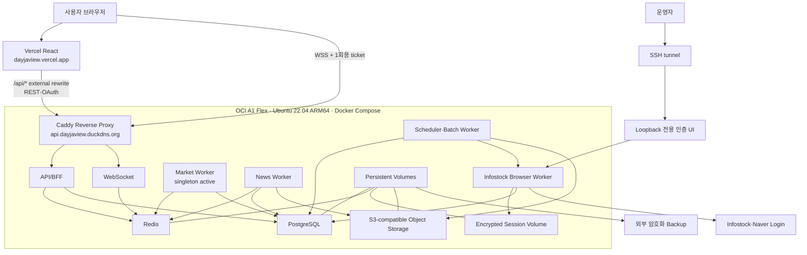

# DAYJAVIEW 시스템 아키텍처

- 문서 버전: `1.1-draft`
- 문서 상태: 구현 전 기준안 — 애플리케이션 토폴로지는 `ADR-001`, 초기 OCI 운영 플랫폼은 `ADR-009`로 `accepted`
- 최종 수정일: 2026-08-14
- 제품 기준: [PRD.md](./PRD.md)
- 화면 기준: [screen_spec.md](./screen_spec.md)
- 구현 로드맵: [implementation_roadmap.md](./implementation_roadmap.md)
- 실시간 기능 세부사항: [realtime_theme_feature_spec.md](./realtime_theme_feature_spec.md)
- 인포스탁 DB 세부사항: [infostock_db_implementation_plan.md](./infostock_db_implementation_plan.md)

---

## 0. 문서 목적과 권한

이 문서는 DAYJAVIEW 전체 시스템의 구성요소, 책임, 데이터 흐름, 상태 소유권, 배포 경계, 장애 처리 기준을 정의한다.

이 문서가 답하는 질문:

1. 프론트엔드·백엔드·수집기·검색 엔진의 경계는 어디인가?
2. 장중 실시간 상태와 영속 데이터는 어디에서 관리하는가?
3. REST와 WebSocket은 각각 무엇을 전달하는가?
4. Event ID는 언제 생성되고 장후까지 어떻게 유지되는가?
5. 외부 공급원 장애 시 시스템은 어떻게 저하되는가?
6. 연구 중인 온톨로지·예측 모델은 운영 제품과 어떻게 분리되는가?
7. 초기 배포는 어떤 단위로 나누고 언제 분리 확장하는가?

이 문서는 세부 DB 컬럼, 전체 API payload, 계산식, 화면 레이아웃을 반복하지 않는다. 해당 내용은 전문 문서를 따른다.

### 문서 우선순위

충돌 시 다음 순서를 따른다.

1. [PRD.md](./PRD.md)의 제품 범위·목표·금지사항
2. 이 문서의 시스템 경계·책임·상태 소유권
3. [screen_spec.md](./screen_spec.md)의 사용자 표현
4. [api_contract.md](./api_contract.md), OpenAPI, AsyncAPI의 통신 계약
5. 기능별 구현 명세

아키텍처의 중요한 변경은 ADR로 기록하고 이 문서에 반영한다.

---

## 1. 아키텍처 목표

### 1.1 기능 목표

- 시장 전체에서 움직이는 종목을 넓게 발견한다.
- 선택된 종목과 활성 테마만 정밀 추적한다.
- 활성 테마의 순위·확산·주도주를 수초 단위로 제공한다.
- 가격 탐지와 상승 이유 확인을 분리한다.
- 장중 Event를 장후 인포스탁 확정까지 동일 식별자로 추적한다.
- 검증된 과거 사례 검색 결과만 조건부 제공한다.
- 데이터·계산·분류·모델 결과를 버전으로 재현한다.

### 1.2 품질 목표

- 0B 수신부터 서버 종목 상태 반영 P95 500ms 이내
- 영향 테마 재계산 P95 1초 이내
- 사용자 화면 반영 P95 3초 이내
- 외부 공급원 일부 장애가 전체 화면 장애로 전파되지 않음
- 재연결 후 최신 전체 snapshot으로 복구
- 결측·지연·Coverage 부족을 0으로 왜곡하지 않음
- 미래 정보 누수를 구조적으로 차단
- 동일 입력·버전에서 동일 결과 재현

### 1.3 운영 목표

- 작은 팀이 한 코드베이스에서 빠르게 개발 가능
- 프론트엔드와 백엔드 병렬 작업 가능
- 컴포넌트별 상태 확인과 독립 재시작 가능
- 데이터 권리와 원본 계보 추적 가능
- 트래픽·복잡도 증가 전 불필요한 분산 시스템 회피

---

## 2. 비목표와 제약

### 2.1 비목표

- 초기부터 마이크로서비스별 독립 저장소·독립 DB 구축
- 키움 한 세션으로 KRX 전 종목 모든 틱 전수 분석
- 거래소 직접 피드 수준의 밀리초 SLA
- 자동매매·주문 실행
- LLM의 자율 인터넷 검색
- 연구 중 v2 예측기의 사용자 실시간 서빙
- 온톨로지 재검증 전 유사사례 일반 공개

### 2.2 외부 제약

- 키움 실시간 시세 세션당 종목 한도
- 키움 REST 호출 한도와 조건검색 결과 포화
- 인포스탁 이용 권리·수집·갱신 방식
- 뉴스 공급원 약관·호출 한도·재배포 범위
- 유동주식비율·조정 가격 공급원 품질
- 장중 실시간 처리는 Windows 기반 키움 연결 환경 제약 가능

외부 한도는 변경될 수 있다. 구현·배포 전 공식 문서와 계약을 다시 확인한다.

---

## 3. 핵심 아키텍처 결정

### 3.1 애플리케이션 토폴로지: 모듈형 모놀리스 코드베이스

**모듈형 모놀리스 코드베이스 + 역할별 독립 프로세스·컨테이너**를 사용한다. 논리 모듈은 분리하지만 처음부터 모든 경계를 네트워크 마이크로서비스로 만들지는 않는다. 기능 범위는 줄이지 않으며 세부 결정은 [ADR-001](./adr/001-application-modularity.md)을 따른다.

이유:

- 제품·데이터 계약이 아직 변경될 가능성이 높다.
- 실시간 계산과 Event 상태의 트랜잭션 경계가 가깝다.
- 작은 팀에서 배포·관측·장애 처리 복잡도를 낮춘다.
- 동일한 검증 라이브러리와 schema를 공유하기 쉽다.

코드베이스는 하나여도 실행 프로세스는 역할별로 분리한다.

```text
API 프로세스
실시간 시장 프로세스
뉴스 수집·매칭 worker
장전·장후 batch worker
운영자 작업 worker
```

프로세스는 독립 재시작·수평 확장이 가능해야 한다. 내부 모듈 경계를 지키면 필요 시 별도 서비스로 분리할 수 있다.

`ADR-001`은 다음 세 대안을 같은 기준으로 비교했다.

1. 단일 배포 모놀리스
2. 공통 코드베이스와 역할별 독립 배포
3. 데이터 소유권까지 분리한 마이크로서비스

평가 기준은 개발량이 아니라 독립 배포, 부하 차이, 장애 전파, 트랜잭션 경계, OS·보안 격리, 팀 소유권, SLO·복구 목표, 운영 비용이다. 현재 단일 OCI 호스트에서는 전면 마이크로서비스의 장애 격리 이점보다 네트워크·배포·분산 트랜잭션 비용이 크다. UI와 외부 API 계약은 이후 내부 서비스 분리에도 영향받지 않아야 한다.

### 3.2 PostgreSQL은 영속 기준 저장소

PostgreSQL 16 이상을 제품의 영속 기준 저장소로 사용한다.

저장 대상:

- 원천 snapshot과 수집 계보
- 테마·종목·membership·revision
- 과거 히스토리와 당시 주도주
- Event와 분류 변경 이력
- 중요 상태 로그와 운영 snapshot
- 뉴스 메타데이터·매칭·근거
- 계산·모델·온톨로지 버전
- 과거 결과와 평가 산출물의 운영 복사본

고빈도 틱마다 DB row를 쓰지 않는다. 사용자 실시간 렌더링 경로에서 DB를 매번 조회하지 않는다.

### 3.3 Redis는 실시간 전달 계층

Redis를 다음 용도로 사용한다.

- 최신 종목 상태와 테마 snapshot의 공유
- process 간 짧은 수명의 event 전달
- WebSocket fan-out
- cooldown·rate limit·짧은 cache
- leader lock 또는 단일 실행 작업 조정

Redis는 원천 데이터나 장기 감사 기록의 기준 저장소가 아니다. Redis 손실 후 PostgreSQL snapshot과 외부 상태 재조회로 복구 가능해야 한다.

초기 단일 프로세스 PoC에서는 in-process memory로 시작할 수 있다. 두 개 이상 프로세스가 실시간 상태를 공유하거나 다중 API instance를 운영하는 시점부터 Redis를 필수로 사용한다.

### 3.4 원본 blob은 객체 저장소

허용 범위 안에서 보존하는 인포스탁 원본, 뉴스 원문 snapshot, 대형 replay fixture는 객체 저장소에 둔다. PostgreSQL에는 위치·해시·수집 시각·권리 범위를 저장한다.

로컬 개발에서 파일 디렉터리를 쓸 수 있으나 운영에서는 버전·보존·암호화가 가능한 객체 저장소로 교체한다.

### 3.5 REST는 조회·복구, WebSocket은 실시간 갱신

- REST: 최초 화면 snapshot, 상세 조회, 과거 데이터, 재연결 복구, 운영 조회
- WebSocket: 실시간 순위·트리맵·Event 상태 snapshot
- 클라이언트는 초기 REST 후 WebSocket을 연결한다.
- WebSocket 재연결 시 서버가 전체 snapshot을 제공한다.
- 초기에는 delta 병합을 만들지 않고 버전된 전체 snapshot을 우선한다.
- WebSocket 장애 시 제한적 REST polling은 폴백이며 정상 동작이 아니다.

SSE는 초기 기준에서 사용하지 않는다. 인증·인프라 제약으로 WebSocket이 불가능할 때 ADR로 재검토한다.

### 3.6 단일 Event 상태 소유자

Event의 생성·상태 전이·현재 분류·버전 증가는 Event 모듈만 수행한다. 다른 모듈은 명령이나 근거를 제출하고 Event 모듈의 결과를 구독한다.

이 원칙은 같은 테마에 중복 Event가 생기거나 뉴스·장후 batch가 상태를 직접 덮어쓰는 문제를 막는다.

### 3.7 검색과 예측 분리

- 과거 사례 검색기는 관련 사건 검색과 관측 결과 요약만 담당한다.
- v2 예측기는 별도 연구·shadow 시스템이다.
- 모델, 입력 snapshot, 출력 계약, 출시 게이트를 공유하지 않는다.
- 공용으로 사용할 수 있는 것은 거래일·outcome·point-in-time 검증 라이브러리뿐이다.

### 3.8 초기 운영 플랫폼은 OCI A1 Flex 단일 VM

초기 staging·production-shadow·production의 운영 호스트는 기존 **OCI `VM.Standard.A1.Flex` 4 OCPU·24GB VM**을 재사용한다. 운영체제 기준은 Ubuntu 22.04 LTS ARM64이며 세부 결정은 [ADR-009](./adr/009-oci-initial-deployment.md)를 따른다.

이 결정은 물리 배치에 관한 것이며 3.1의 논리 모듈 경계를 합치지 않는다. API/BFF, 실시간 처리, 뉴스·인포스탁 수집, scheduler·batch는 같은 VM에 있더라도 별도 process 또는 container로 실행하고 독립 재시작 가능하게 유지한다.

초기 단일 VM은 고가용성 구성이 아니다. 다음을 명시적 제약으로 수용한다.

- 호스트 장애나 재부팅 시 사용자 API와 worker가 함께 중단된다.
- PostgreSQL·Redis·session state의 영속 volume과 외부 암호화 backup이 필요하다.
- 모든 runtime image와 Playwright·Chromium 실행 경로는 `linux/arm64` 호환성 PoC를 먼저 통과해야 한다.
- ARM64에서 browser worker를 안정적으로 운영할 수 없을 때만 해당 worker를 호환되는 별도 실행 환경으로 이동한다. 외부 API 계약과 데이터 소유권은 바꾸지 않는다.
- 부하·장애·복구 지표가 단일 호스트 한계를 보이기 전에는 VM 수를 늘리지 않되, 공개 출시 전 backup 복원과 rollback은 실제로 시험한다.

---

## 4. 시스템 컨텍스트



### 신뢰 경계

- 브라우저는 신뢰하지 않는다. 모든 계산과 권한 검사는 서버에서 수행한다.
- 외부 공급원 payload는 검증 전 신뢰하지 않는다.
- LLM 출력은 비결정적 외부 입력으로 취급하고 schema·근거 검증을 거친다.
- 연구 산출물은 출시 승인을 통과하기 전 운영 서빙 경로에 들어오지 않는다.

---

## 5. 논리 구성요소와 책임

### 5.1 프론트엔드 Web App

책임:

- 로그인·오늘·인사이트·테마 상세·관심·조건부 유사사례 화면
- REST 초기 snapshot과 WebSocket 갱신 결합
- sequence·stale·재연결 상태 처리
- 화면 라우팅과 `themeId`·`eventId` 유지
- LIVE·DELAYED·CLOSED·Coverage·빈 상태 표현
- fixture와 실제 API adapter 교체 가능 구조

하지 않는 일:

- 테마 순위나 수익률 계산
- Coverage 판정
- 상승 이유 생성
- Event 상태 전이
- 유사사례 검색·재정렬

### 5.2 API/BFF 모듈

프론트엔드에 필요한 조회 모델을 제공하는 단일 외부 API 경계다.

책임:

- REST 인증·입력 검증·응답 조합
- 화면용 read model 제공
- WebSocket 연결·topic 구독·snapshot fan-out
- API version·schema version 전달
- rate limit·request ID·오류 형식
- 사용자 관심 항목 read·저장·해제와 계정 삭제 command 전달

API/BFF는 계산 엔진을 복제하지 않는다. 실시간 결과는 Redis snapshot, 영속 상세는 PostgreSQL read model에서 읽는다.

### 5.3 Market Gateway

키움과 통신하는 유일한 모듈이다.

책임:

- 인증과 session 유지
- 조건검색 등록·편입·이탈 수신
- 0B·0J 구독·해제
- REST 안전망과 보조 snapshot
- heartbeat·재연결·재구독
- 외부 field를 내부 canonical event로 정규화
- 공급원 지연·오류 지표

키움 자격정보를 다른 모듈이나 브라우저에 전달하지 않는다.

### 5.4 Subscription Manager

책임:

- 최대 정밀 구독 종목 수 관리
- 후보·Core·주도주·활성 테마 우선순위
- cooldown과 churn 억제
- 슬롯 부족 시 Related를 REST 보완으로 전환
- 현재 구독 상태와 이유 기록

### 5.5 Realtime State Store

책임:

- 최신 종목 가격·등락률·누적 거래대금·freshness
- 최신 시장 지수 상태
- latest-by-key 갱신
- process crash 복구를 위한 주기적 checkpoint

실시간 상태의 hot path는 memory/Redis다. PostgreSQL에는 중요 상태와 1분 운영 snapshot만 비동기 저장한다.

### 5.6 Theme Mapping 모듈

책임:

- 장전 확정된 theme membership version 로드
- 종목에서 Core·Related 테마 역조회
- 신규·미분류 종목군의 기존 테마 overlap 계산
- 과거 membership을 현재에 소급하지 않음

### 5.7 Theme Aggregation 모듈

책임:

- dirty 테마 식별
- 현재 테마 수익률·중앙값·확산·거래 관심 계산
- Core·Related Coverage와 quality flags 계산
- 동일 입력·버전에서 결정적 결과 생성

상세 계산식은 `product_decisions.md`와 실시간 기능 명세를 따른다.

### 5.8 Activation & Ranking 모듈

책임:

- CANDIDATE·ACTIVE·WEAKENING·CLOSED 조건 평가
- hysteresis와 재강화 규칙
- 활성 테마 간 순위 계산
- 현재 순위와 급부상 분리
- Event 모듈에 상태 전이 명령 제출

내부 rank score는 사용자 API에 기본 노출하지 않는다.

### 5.9 Event 모듈

Event 상태의 유일한 writer다.

책임:

- Event ID 발급
- 상태 전이 검증
- 현재 theme classification version 관리
- 주도주·Catalyst·분류 변경과 근거 연결
- 같은 날 재강화·중복 Event 판단
- 장 마감과 장후 확정 연결
- 상태 변경 event 발행

### 5.10 News Ingestion 모듈

책임:

- 허용된 RSS·NAVER 최신순 polling
- cursor·retry·rate limit
- URL·정규화 제목·매체·발행 시각 중복 제거
- 권리 범위에 맞는 metadata·본문 저장
- `feature_news.created` 내부 event 발행

### 5.11 Catalyst Matching 모듈

책임:

- 테마 상태 변화 시 저장 뉴스 검색
- 새 기사 도착 시 활성 Event 역매칭
- 규칙·Entity·선택적 semantic score
- 근거 없을 때 서버 보완 검색 요청
- 근거 후보와 상태를 Event 모듈에 제출

### 5.12 LLM Grounding 모듈

책임:

- 관련성 기준을 통과한 기사만 입력
- 정해진 schema로 종목·테마·상승 이유 구조화
- 기사 범위 안의 자체 요약
- 입력 기사 ID·모델·프롬프트·출력 저장
- schema·인용 근거 검증 실패 시 결과 폐기

하지 않는 일:

- 인터넷 검색
- 근거 없는 원인 보충
- 가격만 보고 원인 생성
- 미래 수익 예측

### 5.13 Infostock Ingestion & Reconciliation 모듈

책임:

- 장전·장후 원본 수집과 versioning
- 테마·히스토리·당시 주도주·membership 정규화
- 장중 임시 분류와 장후 확정 분류 매칭
- 기존 Event ID 유지
- UNMATCHED와 운영자 검수 생성
- 원본 snapshot까지 계보 보존

### 5.14 Historical Matching 모듈

책임:

- 승인된 엔진 버전으로 과거 관련 사건 검색
- 자기 사건·미래 사건·중복 cluster 제외
- 관련성 순서와 `why_similar` 생성
- 검색 완료 후 outcome 결합
- 기간별 유효 분모·중앙값·품질 경고 반환

출시 전에는 feature flag로 외부 API를 차단한다. v1 M-TXT는 재현 기준선이며 최종 서빙 버전이 아니다.

### 5.15 Outcome 모듈

책임:

- KRX 거래일 기준 T+1·T+5·T+20
- 사건 당시 주도주 동일가중 바스켓
- 조정 가격·기업행위·결측 처리
- 기간별 maturity와 유효 분모
- outcome version 관리

검색과 예측 양쪽에서 사용할 수 있으나 미래 결과가 검색 입력으로 전달되지 않게 인터페이스를 분리한다.

### 5.16 Operator 모듈

책임:

- 수집·파싱 실패 확인
- Event 분류·뉴스 근거·UNMATCHED 검수
- 병합·분리 제안 승인
- 자동 결과 수정 이력
- 데이터 제외·복구 처리
- 키움·뉴스·인포스탁 작업 상태와 마지막 성공 시각 조회
- 허용된 실패 작업의 idempotent retry·resume
- 인포스탁 `AUTH_REQUIRED`와 SSH tunnel 재인증 runbook 연결
- process 기본 health와 배포 version 조회

운영자 작업은 삭제·덮어쓰기 대신 새 revision을 만든다. 사용자 API와 별도 `/v1/operator` 권한 경계를 사용하며 서버 shell·secret·cookie·token·credential 원문을 제공하지 않는다.

### 5.17 Research & Model Registry

책임:

- 버전된 point-in-time snapshot으로 연구
- 실험 registry와 봉인 구간 관리
- 온톨로지·검색·v2 예측 평가
- model card·selection report·artifact 보존
- 승인 상태 관리

연구 notebook이나 임시 모델이 운영 PostgreSQL writer 권한을 갖지 않는다.

### 5.18 User Identity & Saved Library 모듈

책임:

- Google `sub` 기준 내부 사용자 ID와 최소 프로필 관리
- 서버 session 생성·폐기와 사용자·pilot·operator 권한 분리
- 사용자별 관심 테마·종목·현재/과거 Event 저장·해제
- 저장 목록에 공용 read model의 현재 상태와 최근 변경 결합
- 계정 삭제 시 session·프로필·저장 데이터 제거

저장 여부는 개인화 계산 입력이 아니다. Theme Aggregation, Ranking, Historical Matching과 공용 WebSocket snapshot은 사용자 저장 데이터에 의존하지 않는다. User Library는 공용 read model을 읽어 개인 목록에 붙일 수 있지만 공용 도메인 테이블을 수정할 수 없다.

---

## 6. 모듈 경계와 의존성 규칙



규칙:

- 외부 adapter는 domain 모듈을 호출한다. domain이 외부 SDK 타입에 의존하지 않는다.
- Event 외 모듈은 Event 테이블을 직접 수정하지 않는다.
- API/BFF는 공급원 SDK를 직접 호출하지 않는다.
- 프론트엔드는 내부 DB schema를 알지 않는다.
- Historical Matching은 Outcome 저장소를 검색 score 입력으로 받을 수 없다.
- LLM Grounding은 선택되지 않은 기사나 외부 검색 결과에 접근하지 않는다.
- batch worker는 실시간 hot state를 조용히 덮어쓰지 않는다.
- User Library는 저장 여부를 ranking·matching·공용 cache key에 입력하지 않는다.

---

## 7. Event ID와 상태 수명주기

### 7.1 식별자 구분

| 식별자 | 의미 | 변경 여부 |
|---|---|---|
| `stockId` | canonical 상장 종목 | 종목코드 변경과 분리 |
| `themeId` | canonical 테마 개념 | 분류 변경 시 Event 연결 대상이 바뀔 수 있음 |
| `eventId` | 한 거래일의 한 촉매·움직임 수명주기 | 생성 후 변경 금지 |
| `matchedEventId` | 과거 검색 결과 Event | 현재 Event와 별도 |
| `newsId` | 정규화된 뉴스 항목 | 변경 금지 |
| `classificationVersion` | Event의 테마명·themeId revision | 변경마다 증가 |

### 7.2 Event 생성

Event 모듈은 다음 입력을 받는다.

- 활성화 기준을 충족한 기존 테마
- 기존 테마로 설명되지 않는 동반 상승 cluster
- 같은 날 기존 Event의 재강화 후보

Event ID는 저장 성공과 함께 발급한다. 형식은 정렬 가능한 opaque ID를 권장한다. 날짜·테마명을 ID 의미로 인코딩하지 않는다.

### 7.3 중복과 재강화

- 같은 거래일·같은 canonical theme·같은 Catalyst cluster의 재강화는 기존 Event를 우선한다.
- 약화 후 정해진 시간 안에 회복하면 같은 Event ID를 유지한다.
- 다른 촉매가 확인되거나 상태 종료 후 독립 움직임이 시작되면 새 Event 후보로 처리한다.
- 정확한 시간 임계값은 설정과 `rankingModelVersion`으로 관리한다.

### 7.4 상태 전이

Event 상태는 한 enum에 모든 의미를 넣지 않는다. 다음 세 축을 독립적으로 관리한다.

| 상태 축 | 소유 모듈 | 목적 | 주요 값 |
|---|---|---|---|
| `lifecycleStatus` | Event | 장중 탐지·활성·종료 수명주기 | `CANDIDATE`, `ACTIVE`, `WEAKENING`, `CLOSED`, `DISCARDED` |
| `reconciliationStatus` | Infostock Reconciliation | 장후 인포스탁 분류 정합 결과 | `PENDING`, `MATCHED`, `UNMATCHED` |
| `evidenceStatus` | Catalyst Matching | 상승 이유 근거 수준 | `SEARCHING`, `SINGLE_SOURCE`, `MULTI_SOURCE_CONFIRMED`, `NO_NEW_CATALYST`, `REEMERGENCE`, `AFTER_CLOSE_CONFIRMED` |

장중 생명주기는 다음과 같다.



`DISCARDED`는 운영·평가 기록으로 보존하되 사용자 기본 조회에서 제외한다.

장후 정합은 `lifecycleStatus=CLOSED`를 바꾸지 않고 별도 상태로 진행한다.



- `UNMATCHED`이면 운영자 검수 항목을 만들고 과거 통계 자동 연결을 금지한다.
- 검수 작업 자체의 진행 상태는 `reviewStatus=PENDING|RESOLVED`로 별도 관리한다.
- 기존 기능 명세의 `INFOSTOCK_MATCHED`는 `reconciliationStatus=MATCHED`에 대응한다.
- 기존 기능 명세의 `REVIEW_REQUIRED`는 `reconciliationStatus=UNMATCHED`와 `reviewStatus=PENDING` 조합에 대응한다.
- `AFTER_CLOSE_CONFIRMED`는 Event 생명주기 상태가 아니라 `evidenceStatus`다.
- 신규 API 계약은 위 분리 모델을 사용하고 기존 결합 enum을 새로 확산하지 않는다.

### 7.5 분류 revision

장중 표시명·themeId는 추정일 수 있다. 장후 확정 시 Event를 새로 만들지 않고 classification revision을 추가한다.

```text
eventId 유지
classificationVersion 증가
이전 themeId·displayName 보존
새 themeId·displayName 적용
source·changedAt·reason 기록
```

장중 snapshot과 장후 확정값을 모두 재현할 수 있어야 한다.

---

## 8. 데이터 계층과 소유권

### 8.1 계층

```text
외부 원본
정규화 기준 데이터
실시간 hot state
도메인 Event와 revision
파생 metric·read model
연구 snapshot·artifact
```

### 8.2 저장 위치

| 데이터 | 기준 저장소 | 갱신 방식 | 보존 |
|---|---|---|---|
| 인포스탁·허용 뉴스 원본 | Object Storage + PostgreSQL metadata | batch·polling | 권리 정책 기준 |
| 테마·종목·membership | PostgreSQL | versioned batch | 장기 |
| 과거 당시 주도주 | PostgreSQL | append/revision | 장기 |
| 최신 종목 상태 | process memory + Redis | tick | 단기 |
| 최신 테마 metric | Redis | dirty recompute | 단기 |
| Event·분류 이력 | PostgreSQL | state transition | 장기 |
| 중요 Event log | PostgreSQL | append | 장기 |
| 1분 운영 snapshot | PostgreSQL 또는 시계열 partition | async batch | 정책 기준 |
| 뉴스 매칭·Catalyst 근거 | PostgreSQL | event-driven | 장기 |
| 과거 outcome | PostgreSQL 분석 schema | maturity batch | 장기 |
| 연구 feature·fold | 버전된 연구 저장소 | offline | 실험 기준 |
| 모델 artifact | Model Registry/Object Storage | 승인된 publish | 버전별 |
| 사용자 최소 프로필·session·저장 항목 | PostgreSQL | 사용자 mutation | 계정 삭제 정책 기준 |

### 8.3 DB schema 경계

초기 권장 schema:

```text
ingest       원본 수집 실행·snapshot·오류
core         종목·테마·membership·거래일·기준정보
event        Event·분류·상태·주도주
news         기사·cursor·매칭·근거
analytics    metric snapshot·outcome·품질 결과
serving      화면용 read model·materialized view
identity     Google subject·session·역할
library      사용자별 saved theme·stock·event
ops          작업·검수·audit
```

research 전용 중간 feature와 실험 결과는 운영 schema에 직접 섞지 않는다.

### 8.4 쓰기 권한

| 역할 | 허용 |
|---|---|
| migration | DDL |
| ingestion writer | ingest·허용된 core upsert |
| realtime writer | Event 명령, metric checkpoint |
| news writer | news schema |
| batch writer | outcome·장후 revision |
| API reader | serving·필요한 domain read |
| identity/library writer | identity·library의 현재 사용자 row만 |
| research reader | 버전된 snapshot read-only |

운영 애플리케이션 writer에 DDL 권한을 주지 않는다.

---

## 9. 내부 통신과 event 전달

### 9.1 내부 event envelope

내부 비동기 event는 최소 다음 metadata를 가진다.

```text
eventType
eventVersion
messageId
occurredAt
receivedAt
producer
correlationId
causationId
payload
```

이 envelope의 상세 schema는 AsyncAPI와 내부 schema에 정의한다.

### 9.2 초기 전달 방식

- 같은 프로세스 내부: in-process function/event dispatcher
- 프로세스 간 실시간 전달: Redis Streams 권장
- WebSocket fan-out: Redis Pub/Sub 또는 Streams consumer 결과
- 장기 감사가 필요한 event: PostgreSQL append log

Pub/Sub만으로 중요한 상태 전이를 보존하지 않는다. Event 상태 전이는 PostgreSQL transaction 성공 후 전달한다.

### 9.3 outbox

Event·분류·뉴스 근거처럼 DB 변경과 외부 전달이 함께 필요한 작업은 transactional outbox를 사용한다.

```text
domain row 변경 + outbox row 기록
같은 PostgreSQL transaction commit
outbox publisher가 Redis Stream 발행
consumer가 idempotency key로 처리
```

PoC에서는 단순화할 수 있으나 첫 다중 프로세스 통합 전에 적용한다.

### 9.4 idempotency

- 외부 수집: source ID·canonical URL·content hash
- market event: session·type·stock·trade timestamp·sequence 조합
- 내부 event: `messageId`
- batch: job name·business date·input version
- API mutation: idempotency key 또는 domain natural key

consumer 재처리가 중복 Event·뉴스·revision을 만들지 않아야 한다.

### 9.5 ordering

- 종목 실시간 상태는 종목별 `receivedAt`과 공급원 sequence를 기준으로 오래된 갱신을 버린다.
- 테마 snapshot은 서버의 단조 증가 `sequence`를 사용한다.
- Event 상태는 `stateVersion` optimistic concurrency를 사용한다.
- 분류는 `classificationVersion` 증가 순서를 사용한다.

---

## 10. 장전·장중·장후 데이터 흐름

### 10.1 장 시작 전



필수 조건이 준비되지 않으면 장중 프로세스를 정상 LIVE로 시작하지 않는다. 가능한 범위와 결측을 DEGRADED 상태로 명시한다.

### 10.2 장중 시장 흐름



사용자 요청별로 계산하지 않는다. 계산된 공용 snapshot을 모든 사용자가 공유한다.

### 10.3 뉴스 근거 흐름



### 10.4 장 마감 후



---

## 11. 외부 API와 프론트 계약 원칙

상세 endpoint와 payload는 [api_contract.md](./api_contract.md), OpenAPI, AsyncAPI에서 확정한다.

### 11.1 REST 원칙

- `/v1`처럼 명시적 major version
- 날짜·시각은 ISO 8601
- 수익률은 문자열 `%`가 아닌 소수 원값
- 계산 불가 값은 `null`; 실제 0과 구분
- 모든 실시간 read model에 `asOf`, `dataStatus`, version metadata
- 목록 pagination과 정렬 기준 명시
- 오류는 공통 code·message·requestId·details
- 내부 rank score·비밀 공급원 필드는 기본 제외

### 11.2 WebSocket 원칙

- 기존 연결 하나에서 topic 구독
- 구독 직후 전체 snapshot
- 모든 snapshot에 `sequence`, `asOf`, `dataStatus`
- 오래된 sequence 무시
- 변경 시 정해진 coalescing 주기에 전체 snapshot
- 변경 없어도 freshness용 주기 snapshot
- 재연결 후 delta가 아닌 전체 snapshot
- 클라이언트별 계산 금지

### 11.3 호환성

- optional field 추가는 같은 major version에서 허용
- 의미·단위·필수 여부 변경은 major version 또는 새 field
- enum 추가에 대해 클라이언트는 UNKNOWN 안전 상태 지원
- 필드 폐기는 최소 한 릴리스의 deprecation 기간 제공
- schema와 fixture가 문서 예제보다 우선하는 기계 기준

---

## 12. Historical Matching과 연구 경계

### 12.1 운영 검색 경로

```text
현재 Event snapshot
승인된 ontology transform
과거 후보 검색
관련성 재정렬
중복·동일 프로젝트 제한
Top K 고정
이후 outcome 조회
기간별 집계
```

Outcome은 후보 선택이 완료되기 전 검색 모듈 인터페이스에 존재하지 않는다.

### 12.2 연구 환경

- 운영 DB replica 또는 export된 immutable snapshot 사용
- 연구 시작 시 dataset snapshot ID 고정
- 연구 code·config·seed·fold·ontology version 기록
- 봉인 구간은 별도 권한과 경로로 보호
- 연구 결과가 직접 production artifact alias를 바꾸지 못함

### 12.3 출시 흐름

```text
연구 후보
offline 평가
2인 블라인드 관련성 검수
새 미사용 봉인 구간 평가
model card·selection report
승인
immutable artifact publish
staging shadow
feature flag 제한 공개
```

### 12.4 v2 예측

v2 예측기는 Historical Matching API에 포함하지 않는다.

- 별도 입력 snapshot
- 별도 prediction contract
- 별도 model registry alias
- 사용자 미노출 shadow 기본
- 검색기 결과를 예측처럼 변환 금지

---

## 13. 배포 아키텍처

### 13.1 환경

| 환경 | 실행 위치 | 데이터·접근 기준 |
|---|---|---|
| `local` | 개발자 PC | fixture 우선, 개발용 credential만 사용 |
| `test/CI` | CI runner | fixture·비식별 replay만 사용 |
| `staging` | OCI VM의 격리된 Compose project | 별도 port·volume·DB, production 비밀정보·데이터 복제 금지 |
| `production-shadow` | Vercel preview + OCI의 격리된 shadow stack | 실제 수집·계산, 일반 사용자 노출은 feature flag로 차단 |
| `production` | Vercel frontend + OCI production Compose project | Vercel app origin, OCI API/WSS TLS, 영구 volume·backup 적용 |

단일 VM에서 staging과 production을 동시에 실행할 때 Compose project 이름, network, port, volume, database credential을 분리한다. 자원 경합이 장중 처리 목표를 해치면 staging을 중지하거나 별도 호스트로 옮긴다.

DNS 예약과 SSH 접속 검증은 애플리케이션 배포와 분리한다. 코드가 없는 상태에서는 빈 container나 placeholder 서비스를 외부에 배포하지 않는다. 첫 staging 배포는 프론트 앱 셸, 제품 데이터를 포함하지 않는 `/api/health`, PostgreSQL·Redis 연결, Google OAuth 기본 흐름과 첫 fixture/API 화면이 함께 실행될 때 수행한다. production 공개는 첫 수직 통합과 출시 검증을 통과한 뒤 진행한다.

### 13.2 Vercel frontend + OCI backend 배치



초기에는 public ingress를 reverse proxy의 `80/443`으로 제한한다. SSH는 public key 인증만 허용하고 운영자 IP 제한을 적용한다. DB·Redis·browser 인증 UI·VNC 계열 port는 public subnet에 직접 노출하지 않는다.

React는 `https://dayjaview.vercel.app`에서 제공한다. browser REST와 Google OAuth는 app origin의 `/api/*`를 호출하고 Vercel external rewrite가 `https://api.dayjaview.duckdns.org`의 OCI API로 전달한다. Google OAuth callback은 `https://dayjaview.vercel.app/api/auth/google/callback`으로 등록한다.

WebSocket은 `wss://api.dayjaview.duckdns.org/v1/realtime`에 직접 연결한다. browser cookie를 cross-site로 보내지 않고, 인증된 `/api/v1/auth/realtime-ticket` 응답의 30초·1회용 ticket을 연결 직후 첫 message로 제출한다. 세부 결정은 [ADR-011](./adr/011-vercel-oci-split-deployment.md)을 따른다.

현재 OCI VM에는 운영자 SSH public key 등록과 접속 검증이 완료됐다. `dayjaview.duckdns.org`와 `api.dayjaview.duckdns.org`의 A record도 OCI VM 공인 IPv4 `168.107.25.213`으로 연결하고 외부 해석을 검증했다. 이는 애플리케이션 배포 완료를 뜻하지 않는다. 이전 프로젝트의 service·container·cron·파일 잔존 여부 확인, OS patch, firewall, Docker Compose, TLS, 영구 volume, backup 구성은 별도 완료 조건이다. private key는 운영자 단말에만 보관하고 서버나 저장소로 복사하지 않는다.

### 13.3 Windows Market Gateway 경계

키움 연결이 Windows 실행 환경을 요구하면 Market Gateway만 Windows worker로 격리한다. 나머지 API·DB·Redis·worker는 일반 서버 환경에서 운영 가능하게 한다.

```text
Windows Market Gateway
TLS/VPN private network
canonical internal events
Redis Streams 또는 authenticated ingestion endpoint
```

Market Gateway host에 사용자 웹 요청을 직접 연결하지 않는다.

### 13.4 인포스탁 인증 세션 경계

인포스탁 browser worker는 API/BFF와 별도 실행 단위로 둔다. API/BFF는 네이버 로그인 브라우저를 실행하거나 session state를 읽을 권한이 없다.

- 최초 배포: 운영자 전용 `bootstrap` 명령이 화면이 보이는 전용 브라우저를 실행하고 운영자가 네이버 로그인을 직접 완료한다.
- 정상 운영: scheduler가 백그라운드 worker를 실행하고, worker는 암호화된 마지막 정상 state를 복원해 수집한 뒤 종료한다.
- 최초·갱신 인증 UI는 서버 loopback에만 bind하고 운영자가 SSH tunnel로 접속한다. 인증용 VNC·noVNC port를 인터넷에 직접 공개하지 않는다.
- 재배포: `INFOSTOCK_SESSION_STATE_PATH`가 위치한 영구 volume을 유지하고 `APPLICATION_ENCRYPTION_KEY`는 state와 다른 root 소유 `0600` production env 파일 또는 OCI Vault에서 주입한다.
- 갱신: 인증된 페이지 marker가 확인된 경우에만 state를 원자적으로 교체한다.
- 만료: 제한된 backoff와 인증 화면 판정 후 `AUTH_REQUIRED`로 전환한다. ID·비밀번호 자동 입력은 하지 않으며 운영자가 `refresh` 명령으로 수동 재로그인한다.
- 동시성: 인증 명령과 수집 실행은 같은 distributed lock을 사용해 state 동시 쓰기를 막는다.

세션은 장기간 유지될 수 있지만 영구성을 보장하지 않는다. 로그아웃·비밀번호 변경·공급자 보안 정책·실행 환경 변경을 모두 정상 만료 원인으로 취급한다.

### 13.5 확장 전략

- API/BFF: stateless 수평 확장
- WebSocket: Redis fan-out으로 다중 instance
- Market Worker: 거래 계정·session 기준 active singleton, standby 준비
- News Worker: source partition별 확장
- Batch Worker: distributed lock으로 중복 실행 방지
- PostgreSQL: read replica·partition·index 순서로 확장
- Redis: persistence·replica·managed failover 검토

### 13.6 서비스 분리 조건

다음 조건 중 하나가 실제로 발생할 때 모듈을 별도 서비스로 분리한다.

- 독립 확장 요구가 지속됨
- 서로 다른 런타임·OS 격리가 필수
- 장애가 다른 기능에 반복 전파됨
- 별도 팀 소유권과 배포 주기가 생김
- 보안·권한 경계를 process 수준으로 강화해야 함

분리 전 ADR과 데이터 소유권 이전 계획이 필요하다.

---

## 14. 가용성·장애·저하 모드

### 14.1 상태 원칙

- 마지막 정상값을 보존한다.
- stale 값을 최신처럼 표시하지 않는다.
- 결측을 0으로 만들지 않는다.
- 공급원별 장애를 구분한다.
- 자동 복구 후 전체 snapshot으로 상태를 맞춘다.
- 복구 불가능한 상태는 작업 상태와 기본 로그에 기록하고 사용자에게 저하 상태를 표시한다.

### 14.2 장애 매트릭스

| 장애 | 서버 처리 | 사용자 상태 |
|---|---|---|
| 키움 0B 연결 종료 | DEGRADED, 재연결·재구독, REST snapshot 보완 | 마지막 정상값 + 수신 지연 |
| 조건검색 포화 | 안전망 조회, 조건 분리, 상태 기록 | 노출 중 테마 유지, Coverage 반영 |
| 200종목 슬롯 부족 | 저우선 해제, Core·주도주 유지 | 일부 테마 데이터 갱신 중 |
| Redis 장애 | API live push 중단, DB checkpoint 폴백, 재구축 | 지연 상태, REST 제한 조회 |
| PostgreSQL writer 장애 | 신규 영속 변경 중단, hot state 제한 유지 | 확정·상세 기능 지연 |
| 뉴스 RSS 일부 장애 | 다른 공급원 계속, retry | 근거 상태 유지 |
| 모든 뉴스 공급원 장애 | LLM 호출 금지 | 상승 이유 확인 중 |
| LLM 장애 | 규칙 매칭 결과 보존, 요약 미생성 | 확인 중 또는 기존 근거 유지 |
| 인포스탁 장후 지연 | CLOSED 유지, retry | 장후 확정 대기 |
| 인포스탁 로그인 세션 만료 | `AUTH_REQUIRED`, 자동 로그인 금지, 운영자 수동 refresh | 장후 확정 대기 |
| 가격·기준정보 결측 | 해당 계산 제외, quality flag | 데이터 부족·계산 불가 |
| 검색 엔진 장애 | circuit breaker, 캐시된 결과 version 표시 또는 영역 숨김 | 유사사례 일시 사용 불가 |

### 14.3 복구

실시간 프로세스 재시작 시:

1. 당일 활성·약화 Event를 PostgreSQL에서 로드
2. 최신 checkpoint를 로드
3. 키움 session 재연결
4. 우선순위 종목 재구독
5. REST snapshot으로 현재 상태 보완
6. metric 전체 재계산
7. 새 sequence의 전체 snapshot 발행

이전 process memory를 복구 기준으로 가정하지 않는다.

### 14.4 목표 복구 지표

정확한 수치는 PoC 후 ADR 또는 SLO 문서에서 확정한다.

- WebSocket 사용자 연결 자동 재시도
- Market Gateway 재연결 시간
- Redis failover 시간
- PostgreSQL RPO·RTO
- 장후 batch 재실행 시간

---

## 15. 보안·개인정보·데이터 권리

### 15.1 인증과 권한

- 로그인 화면·OAuth endpoint·필수 정적 문서·최소 health check 외 모든 제품 화면과 REST·WebSocket 데이터는 Google 로그인 session 필수
- 비로그인·만료 session에는 제품 데이터와 stale cache를 반환하지 않음
- Google OAuth callback 후 `https://dayjaview.vercel.app` 기준 내부 `returnTo`만 허용
- 사용자 API와 운영자 API 분리
- 운영자 역할 기반 권한
- migration·writer·reader DB 계정 분리
- 서비스 간 인증 또는 private network
- WebSocket 연결도 REST와 같은 인증 기준 적용

사용자 endpoint와 운영자 endpoint는 인증·권한을 분리한다. 사용자 session만으로 운영자 endpoint에 접근할 수 없다.

최초 운영자는 배포 시 명시한 verified Google 계정으로 bootstrap하고 내부 사용자 row에는 Google `sub`와 `OPERATOR` 역할을 연결한다. 이후 권한 검사는 email 문자열이나 client 입력이 아니라 서버 session의 내부 역할을 사용한다. 일반 사용자 UI에는 운영자 route를 표시하지 않으며 직접 API 요청은 `403`으로 거부한다.

### 15.2 비밀정보

- 키움·뉴스·LLM credential은 secrets manager 사용
- 인포스탁 browser storage state는 credential과 동일한 등급으로 취급
- storage state는 `APPLICATION_ENCRYPTION_KEY`로 암호화한 뒤 접근 제한된 영구 volume에 저장하고, 키는 state와 분리해 root 소유 `0600` production env 파일 또는 OCI Vault에서 주입
- 네이버 ID·비밀번호 저장 및 자동 입력 금지
- 브라우저 bundle·Git·fixture·로그에 포함 금지
- Authorization header·cookie·token redaction
- rotation과 만료 점검 절차
- local `.env`는 Git 제외, 예시에는 가짜 값만 사용

### 15.3 외부 입력 검증

- 공급원별 schema validation
- 문자열 길이·encoding·HTML sanitization
- 원문 URL allowlist·normalization
- LLM structured output schema validation
- prompt injection text를 명령으로 실행하지 않음
- 사용자 입력을 외부 검색어로 전달할 때 rate limit·escaping

### 15.4 데이터 권리

- 공급원별 수집·저장·가공·표시 허용 범위 기록
- 기사 전문은 명시적 허용 시에만 저장·처리
- 사용자 화면은 자체 요약·매체·시각·원문 링크 중심
- 원본 보존 기간과 삭제 정책 적용
- 인포스탁 운영 수집 전 합법적 접근 경로 확보

### 15.5 개인정보

핵심 제품은 금융계좌·보유종목·주문 정보를 저장하지 않는다. Google 로그인에는 공급자 사용자 ID와 서비스 운영에 필요한 최소 프로필만 저장한다. Google access token·refresh token은 Google API 대리 호출 기능이 없으므로 장기 저장하지 않는다.

사용자 저장 데이터는 `userId`로 격리하며 API가 client의 임의 `userId`를 신뢰하지 않고 session에서 소유자를 결정한다. 계정 삭제 시 모든 session을 폐기하고 최소 프로필·관심 테마·종목·이벤트를 삭제한다. 법적·보안상 보존해야 하는 최소 기록이 생기면 개인 식별 가능성을 제거하고 별도 보존 정책을 명시한다.

---

## 16. 운영 상태와 기본 로그

Sentry·OpenTelemetry·분산 trace·외부 alert·제품 analytics는 구현하지 않는다. 자동 재시도와 장애 복구에 필요한 최소 상태만 DB와 기본 서버 로그에 남긴다.

### 16.1 필수 기록

- 프로세스 시작·정상 종료·치명적 오류
- 외부 공급원 연결 실패와 HTTP 상태
- DB migration 결과
- 수집 `runId`, 상태, 처리 cursor, 성공·실패 건수, `next_retry_at`
- 키움·뉴스·인포스탁의 마지막 정상 수신 시각
- `RATE_LIMITED`, `AUTH_REQUIRED`, `DEGRADED` 전환과 복구

### 16.2 로그 원칙

- 기본 출력은 구조화 JSON 또는 한 줄 key-value 형식
- production 기본 수준은 `info`
- 같은 오류의 반복 로그는 rate limit
- credential·Authorization header·cookie·token·사용자 원문 입력은 기록 금지
- 자동 삭제 또는 rotation으로 보존 기간 제한

### 16.3 제외 범위

- 외부 오류 수집 SaaS
- 분산 tracing과 trace exporter
- 별도 metric dashboard
- 이메일·SMS·Web Push·텔레그램을 통한 외부 메시지 전송
- 사용자 행동 analytics

---

## 17. 버전과 재현성

모든 사용자 결과에 필요한 버전을 연결한다.

| 버전 | 대상 |
|---|---|
| `apiVersion` | 외부 API major 계약 |
| `schemaVersion` | payload·내부 event schema |
| `membershipVersion` | 테마-종목 관계 |
| `baselineVersion` | 동일 시각 거래대금·기준정보 |
| `rankingModelVersion` | 활성화·순위 규칙 |
| `catalystModelVersion` | 뉴스 매칭·구조화 |
| `ontologyVersion` | 사건 온톨로지 |
| `matchingEngineVersion` | 과거 검색기 |
| `outcomeVersion` | 바스켓·기간 결과 계산 |
| `dataSnapshotId` | 연구·재현 데이터 |

버전 변경 규칙:

- 의미·계산·입력 범위가 바뀌면 새 버전
- 과거 결과를 새 버전으로 조용히 덮어쓰지 않음
- 화면 cache key에 관련 version 포함
- 연구 보고서와 model card에 artifact hash 기록
- rollback 시 이전 immutable artifact와 schema 호환성 확인

---

## 18. 테스트 아키텍처

### 18.1 계층

```text
순수 domain 단위 테스트
adapter contract 테스트
DB·Redis 통합 테스트
저장 체결 replay
API·WebSocket contract 테스트
프론트 fixture 테스트
E2E 핵심 여정
shadow 운영 대조
```

### 18.2 공통 fixture

프론트·백엔드가 같은 schema와 fixture를 사용한다.

- 정상 LIVE
- DELAYED·CLOSED
- Coverage 충분·부분·미달
- 재연결과 오래된 sequence
- 상승 이유 확인 중·뉴스 추정·장후 확정
- Event 분류 변경
- 표본 0·소수·충분
- 가격 누락·관찰 중

### 18.3 replay

- 원본 credential과 개인정보 제거
- market event ordering 보존
- 고정 clock과 거래일 사용
- 동일 replay에서 결과 hash 비교
- 장애·재연결·slot churn 주입 가능

### 18.4 point-in-time 안전성

- 입력 `asOf <= decisionAt`
- 뉴스 `publishedAt <= decisionAt`
- membership `knownAt <= decisionAt`
- 미래 주도주·가격·분류가 장중 입력에 없음
- 결과 데이터가 검색 후보 선택 전에 접근되지 않음

---

## 19. 저장소와 코드 구조 권장안

디자이너 프로토타입은 변경하지 않는 참고 원본으로 유지한다. 현재 `C:\dayjaview` 작업물을 팀 소유의 새 비공개 production GitHub 저장소로 승격하며 두 저장소에 제품 기능을 동시에 구현하지 않는다. 세부 결정은 [ADR-010](./adr/010-production-repository.md)을 따른다.

production 저장소는 다음 monorepo 형태를 사용한다.

```text
apps/
  web/
  api/
  worker-market/
  worker-news/
  worker-batch/

packages/
  contracts/
  domain/
  calculations/
  test-fixtures/

research/
  ontology/
  matching/
  prediction-v2/

infra/
  migrations/
  deployment/
  operations/

docs/
  adr/
```

원격 저장소를 생성할 때 실제 GitHub owner·URL, 관리자, reviewer와 배포 권한을 설정한다. 이는 승인된 저장소 전략을 바꾸는 아키텍처 게이트가 아니라 provisioning 작업이다. 중요한 기준:

- 기계 계약과 fixture의 단일 소유 위치
- domain 계산의 중복 금지
- 연구와 운영 entrypoint 분리
- 배포 가능한 프로세스 경계 명시
- 프론트 빌드에 서버 비밀정보 포함 금지

---

## 20. ADR 필요 항목

다음 결정은 구현 전 ADR로 고정한다.

| ADR | 결정 |
|---|---|
| [`001-application-modularity.md`](./adr/001-application-modularity.md) | 모듈형 모놀리스와 process·container 경계 |
| `002-event-id-lifecycle.md` | Event 생성·중복·재강화·장후 revision |
| `003-realtime-transport.md` | REST + WebSocket, snapshot·sequence·재연결 |
| `004-realtime-state-storage.md` | memory·Redis·PostgreSQL 책임 |
| `005-internal-event-delivery.md` | Redis Streams·outbox·idempotency |
| `006-windows-market-gateway.md` | 키움 Windows worker 배포 경계 |
| `007-historical-matching-release-gate.md` | 온톨로지 재검증과 feature flag |
| `008-source-data-rights.md` | 공급원별 저장·가공·표시 범위 |
| [`009-oci-initial-deployment.md`](./adr/009-oci-initial-deployment.md) | OCI A1 Flex 단일 VM 초기 운영 배치 |
| [`010-production-repository.md`](./adr/010-production-repository.md) | 디자이너 원본과 분리된 팀 소유 비공개 production 저장소 |

ADR은 결정·배경·대안·결과·상태를 포함한다. 아직 검증되지 않은 선택은 `proposed`로 둔다.

---

## 21. 확정·가설·미결정

### 21.1 이 문서에서 확정하는 기준

- PostgreSQL 영속 기준 저장소
- Redis 실시간 공유·fan-out 계층
- REST 초기·상세 조회, WebSocket 실시간 snapshot
- Event 모듈 단일 상태 writer
- 원본과 정규화 데이터 분리
- 검색과 예측 분리
- 연구 artifact 승인 후 운영 반영
- 유사사례 feature flag와 온톨로지 출시 게이트
- 초기 운영 플랫폼은 OCI A1 Flex 단일 VM, Ubuntu 22.04 LTS ARM64
- 같은 VM에서도 역할별 process·container와 환경별 volume·credential 분리
- 모듈형 모놀리스 코드베이스와 역할별 독립 process·container
- 디자이너 프로토타입은 참고 원본으로 유지하고 팀 소유 비공개 production 저장소에서만 제품 구현
- 운영자 콘솔은 Google `OPERATOR` 역할 전용이며 사용자 route·API·projection과 분리
- 사용자 frontend는 `dayjaview.vercel.app`, backend API·WSS는 OCI의 `api.dayjaview.duckdns.org`
- REST·OAuth는 Vercel external rewrite, WebSocket은 OCI direct WSS와 1회용 ticket 인증

### 21.2 PoC 후 확정할 가설

- 역할별 container의 resource limit·replica 수와 최종 묶음 단위
- Redis Streams와 Pub/Sub의 정확한 사용 범위
- 실시간 checkpoint 주기와 보존 기간
- WebSocket snapshot 주기·coalescing 값
- Windows Market Gateway의 배포 위치
- API instance 수와 Redis failover 구성
- PostgreSQL partition·read replica 도입 시점
- 객체 저장소 제품과 원본 보존 기간
- OCI A1 ARM64에서 Infostock browser worker의 안정성·메모리 사용량

### 21.3 사용자·계약·외부 확인이 필요한 미결정

- 정식 일반 공개 전에 구매할 소유 도메인과 Vercel·OCI hostname 이전 시점
- 인포스탁 합법적 접근·갱신 경로
- 뉴스 공급원 이용 조건
- KRX Open API·OpenDART 기반 자체 유동주식비율 산출식과 Coverage 검증
- RPO·RTO와 정식 SLO

미결정 항목을 임의로 구현 확정하지 않는다. 구현을 막지 않는 부분은 adapter와 설정 경계로 격리한다.

---

## 22. 아키텍처 검수 체크리스트

### 경계

- [ ] 각 모듈의 writer와 reader 책임이 겹치지 않는다.
- [ ] Event 상태 writer가 하나다.
- [ ] 프론트가 계산·분류 로직을 소유하지 않는다.
- [ ] API/BFF가 외부 공급원 SDK를 직접 호출하지 않는다.
- [ ] 검색과 outcome 인터페이스가 미래 정보 누수를 막는다.
- [ ] 연구와 운영 artifact 경계가 있다.

### 데이터

- [ ] 원본·정규화·파생 데이터 계층이 분리됐다.
- [ ] 현재 관련주와 과거 당시 주도주가 분리됐다.
- [ ] hot state 손실 후 복구 경로가 있다.
- [ ] 결측·stale·Coverage가 명시적 상태다.
- [ ] 주요 결과에 version과 `asOf`가 있다.
- [ ] revision과 audit log가 덮어쓰기를 대신한다.

### 실시간

- [ ] 키움 한도를 전제로 구독 우선순위가 있다.
- [ ] dirty 테마만 계산한다.
- [ ] 사용자별 계산을 하지 않는다.
- [ ] snapshot sequence와 재연결 규칙이 있다.
- [ ] WebSocket 장애 폴백이 정의됐다.
- [ ] 다중 process에서 Redis와 outbox 경계가 정의됐다.

### 보안·운영

- [x] 초기 운영 플랫폼과 단일 호스트 제약이 기록됐다.
- [x] OCI VM의 SSH public key 접속이 검증됐다.
- [ ] 이전 프로젝트 잔존 service·container·cron·파일 제거가 검증됐다.
- [ ] ARM64 runtime·Playwright·Chromium PoC가 통과했다.
- [ ] credential이 브라우저·Git·로그에 노출되지 않는다.
- [ ] 운영자 API 권한이 분리됐다.
- [ ] 외부 payload와 LLM 출력이 검증된다.
- [ ] 공급원별 데이터 권리가 기록된다.
- [ ] 자동 복구에 필요한 작업 상태와 기본 로그가 남고 비밀정보가 제거된다.
- [ ] backup·복구·rollback 절차가 있다.

### 구현 준비

- [ ] 미결정 항목이 adapter·설정 경계로 격리됐다.
- [ ] 필수 ADR 소유자와 검토자가 지정됐다.
- [x] [api_contract.md](./api_contract.md)가 이 경계를 따른다.
- [x] [ui_prototype_adaptation_plan.md](./ui_prototype_adaptation_plan.md)가 프론트 책임을 따른다.
- [ ] OpenAPI·AsyncAPI·fixture가 같은 식별자·상태 모델을 사용한다.

이 체크리스트와 단계 0 아키텍처 게이트를 통과한 뒤 프론트·백엔드 구현 계약을 동결한다.
